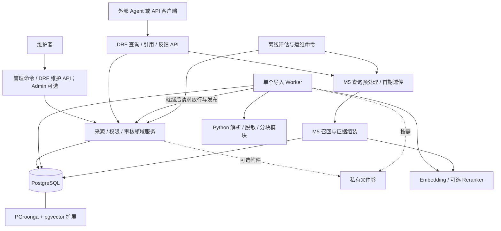

# itxiaAgent 知识库首期技术方案设计

版本：v0.11（待实施设计，简化处理器、配置切换与反馈流程）  
日期：2026-10-01  
依据：[首期需求与技术选型](/home/kurfuerst/Coding/nju/itxiaRAG/docs/phase1/phase1-requirements-and-selection.md) · [总体需求](/home/kurfuerst/Coding/nju/itxiaRAG/docs/requirements.md) · [总体技术选型](/home/kurfuerst/Coding/nju/itxiaRAG/docs/technology-selection.md)

本方案采用 Django 模块化单体、PostgreSQL 和单个导入 Worker，附件按需使用私有文件卷，打通“授权资料 → 自动校验／异常复核 → 统一发布 → 混合检索 → 带出处的证据”。首期维护入口以命令和 DRF API 为主，后台网页界面按需启用；先交付可维护、可查询的文本知识库，再增加语义检索和运行保障。

**最小实现。** 来源表保存身份、权限和 `current_build_id`；`import_job` 合并本次输入、处理任务、构建与审核，任务 ID 就是构建 ID；`context_unit` 保存完整父段，`evidence_unit` 保存可检索子块。加一张配置表即可运行，迭代四再加查询记录和反馈，共 5／7 张业务表。更新和重建共用导入流程，只服务当前已放行构建；旧产物可清理，不提供历史正文查询或回滚。

本文中的模块、字段、接口、启动命令和验收工具均为拟实现契约，不表示当前仓库已经有对应代码或通过性能测试。四个迭代均须能从空数据库启动并完成真实业务操作，不依赖未来模块；完整首期能力在迭代四完成验收。

**范围说明。** 本文定义首期多来源知识库的通用导入、存储、权限和检索契约。迭代一先实现 manual 短笔记同步一父一子的最小链路；父子分块的第一个领域专用策略使用 `source_type=wechat + document_schema=product_review` 的笔吧笔记本评测，在迭代二接入。对该策略，同一文章中一台笔记本的全部评测内容形成一个父段，多台笔记本形成多个父段；子块 `evidence_unit` 负责检索，查询按父段返回。语雀基础知识、维修记录、独立购买指南不受这一边界限制，接入时注册各自 Schema／处理器并复用相同表和 API。领域处理器可先验收笔吧链路；第 8 节完整首期的三类来源和三个查询场景验收目标保留。

**文档与契约的维护位置。** 总体需求定义业务目标和优先级，首期需求文档限定本次交付范围，技术选型文档记录选择理由；本文统一定义首期的数据对象、状态、配置和 API 字段，其他文档引用这些细节。实现后，以 DRF Serializer 执行请求／响应字段契约并生成 OpenAPI，以共享契约测试验证示例和适配器；变更需同步本文，不能让代码与设计各自成为一套定义。通用测试规则单独维护在[项目单元测试规范](/home/kurfuerst/Coding/nju/itxiaRAG/docs/unit-testing-guidelines.md)，不在各需求文档重复定义。

## 1. 系统边界

### 1.1 系统负责什么

| 参与方 | 职责 | 与本系统的交互 |
| --- | --- | --- |
| 知识维护者 | 确认授权、提供脱敏资料、修订字段、处理异常复核、发布和反馈 | 管理命令或获授权的维护 API；Django Admin 可选 |
| 知识库 | 保存来源与当前构建、执行导入、管理可见性、查询和返回证据；预留原始查询的意图识别与改写能力 | 首期查询预处理采用透传实现，规则／LLM 实现后续按需接入 |
| 外部 Agent／客户端 | 可先整理查询及已确认条件，也可提交原始查询；负责对话状态、追问、组织回答、转人工 | 提交 `query` 等参数；已整理的查询可跳过知识库预处理，普通 API 客户端也可独立调用 |
| 检索模型服务 | 文档／查询向量化，可选候选重排 | 本地推理或已获准的服务，不承担回答生成 |
| 笔吧评测室笔记本评测推文 | 首个父子处理器的验证来源 | 获准后由成员整理为 TXT／Markdown，人工导入 |
| 社团语雀笔记、维修经验记录 | 首期通用来源契约和人工导入样本 | 按各自 Schema 保留标题／案例字段、原始定位、日期、授权和可见性；领域处理器可独立迭代 |

首期保留评测中的产品配置、测试条件、测量结果、作者观点、购买限制及原有警告。返回历史价格不等于当前报价；维修资料需要区分观察与诊断。

### 1.2 不纳入本期的能力

- M6 知识页／FAQ／Spec 的专门编辑、派生内容及其依赖管理；已有 FAQ 或流程文本可以作为普通来源导入。
- Agent 开发、对话状态、追问策略、最终回答及转人工交互。首期不接入生成模型；知识库内部的意图识别、查询改写和条件提取属于可选后续增强，首期只保留模块接口与透传实现。
- 自动同步语雀／公众号、在线抓取、实时价格查询、复杂 PDF／OCR。
- 多跳图检索、独立图数据库、全库 GraphRAG、自动微调和持续自进化。
- 多租户、多个导入 Worker、通用任务调度器；Haystack 为后续可选编排框架。

### 1.3 首期必须坚持的约束

1. PostgreSQL 中的来源权限、撤回状态、当前发布构建是权威依据，索引不能自行授权。
2. 未放行内容和未完成的索引构建不参与普通查询；导入失败保留上一有效构建。
3. 可引用片段绑定确定的导入构建与位置；更新通过候选构建质量放行后切换，不能原地改在线产物。
4. 原始日期未知时保留未知，设备／配置不明时不能伪装成精确匹配。
5. 资料内容只作为数据，不执行其中的指令，也不根据资料文字改变权限或发布状态。
6. 服务故障与“没有找到资料”分开返回；降级不能放宽权限或隐藏资料时效。

## 2. 总体架构与模块边界

### 2.1 运行结构



正式首期有 Web/API、单 Worker、PostgreSQL 三个常驻运行单元，Web 和 Worker 使用同一应用镜像。检索模块是应用内 Python 模块，不另建“检索微服务”。纯文本输入存数据库；使用附件时，私有文件卷供 Web 与 Worker 使用；模型可运行在独立推理服务中，也可使用获准的现有服务，按实际资源选择。

导入、文档向量化和批量重建索引由 Worker 执行。**查询预处理、查询向量化和启用的重排属于在线路径**，需要计入查询超时及 P95。首期预处理透传，不增加模型服务；后续处理器按配置启用。离线评估通过命令执行，不阻塞维护页面。

### 2.2 模块职责与交互

| 模块 | 负责的内容 | 输入 → 输出 | 不负责的内容 |
| --- | --- | --- | --- |
| M1 Web 与维护入口 | Django 认证、DRF 路由及序列化；提供管理命令，Admin 作为可选界面 | HTTP／命令 → 已校验参数、调用身份 | 不复制发布和权限规则，不执行耗时批量导入；不要求首期建设网页后台 |
| M2 来源与发布 | 来源、授权、审核、当前构建、发布／撤回、权限查询、审计；PostgreSQL 和私有附件 | 领域命令 → 当前构建、状态、审计记录 | 不以索引代替事实和权限，不维护 M6 页面 |
| M3 文本处理 | 可替换的格式解析器与文档处理器：脱敏辅助、Schema 校验、字段映射、父上下文构建、分块及定位 | 允许处理的本次固定输入 → 统一证据草稿、字段、警告 | 不猜测缺失事实，不联网取原文、不写库、不发布、不调度任务 |
| M4 导入执行 | PostgreSQL 任务表、单 Worker，按固定配置处理本次取得的输入并调用 M3 和编码／索引适配器，校验、幂等写入、有限重试和恢复 | 导入任务 + IndexProfile 配置及 hash → 构建结果和任务状态 | 不内置各类文档的解析规则，不绕过 M2 发布，不建设通用 DAG 或多 Worker 调度 |
| M5 检索 | 可替换的查询预处理、权限筛选、词法／dense 召回、RRF、可选重排、条件和状态整理 | 原始或已整理查询 + 身份 + 可选场景／已确认条件 → 结构化证据包 | 首期不实现智能预处理；不维护对话、不生成最终回答，不把排名分数当作确诊概率 |
| M6 后续知识整理 | P1 后再建设 FAQ／主题页／Spec 及派生内容依赖 | 首期无接口或运行依赖 | 首期不建表、不提供占位服务 |
| M7 对外契约 | 定义查询、引用、反馈和维护 API 的字段、状态、错误码与版本 | 外部请求 ↔ 稳定领域对象 | 不开发 Agent，不接入生成模型；与 M1 共用 DRF |
| M8 评估与运行 | 问题集、查询记录、Trace、指标、备份恢复、部署和交接说明 | 固定样本／运行数据 → 评估报告和运行记录 | 不要求 LLM judge、Langfuse 或回答生成评估 |

M1 提供传输层与维护入口，M7 是外部接口契约，二者不是两套服务。M2 的领域服务统一执行自动放行、人工复核、发布和可见性规则；DRF、管理命令、Worker 和可选 Admin 都必须使用这些规则。

M2 可直接放在 Django 的 `catalog` 包中，用提交、质量放行、发布和可见性检查等普通函数集中实现业务规则。API、管理命令和可选 Admin 复用这些函数；Worker 只生成候选并请求自动放行，检索只读取当前获准构建。模块编号用于划分职责，不要求独立服务或额外框架。

### 2.3 建议的内部组织与最小接口

按业务组织为 `catalog`、`ingestion`、`retrieval`、`api`、`evaluation` 几组 Python 模块即可，无须给每个 M 编号建立独立服务。以下是待实现接口，不是现有源码：

| 接口 | 责任模块 | 输入／输出约定 |
| --- | --- | --- |
| `submit_import` | M2 | 来源、正文或外部来源定位、文档 Schema 标识及可选元数据 → 调用共享校验器 → 导入任务与候选构建 |
| `parse_and_chunk` | M3 | 本次固定输入、固定 IndexProfile → 调用格式解析器与按 Schema 选择的文档处理器 → 统一证据草稿及质量警告；组合规则见第 2.6 节 |
| `run_import_job` | M4 | 任务 ID → 构建就绪或失败；就绪后调用 M2 自动放行流程，不直接修改在线指针 |
| `publish_build` | M2 | 导入任务、操作主体 → 校验构建、自动／人工放行结论及来源权限，切换当前构建；自动操作使用系统账号 |
| `visible_evidence` | M2/M5 | 身份、用途、配置 → 带统一权限和状态条件的查询集合 |
| `prepare_query` | M5 查询预处理 | `QueryInput` → `PreparedQuery`；首期透传，后续替换规则／LLM 处理器 |
| `search` | M5 | 查询请求、服务端身份 → 证据包；模型不可用时按策略降级 |
| `get_context`／`get_evidence` | M2/M7 | 父段／子块 ID、身份 → 固定构建的父段上下文及出处，重新检查当前权限 |

解析模块不依赖 HTTP；检索模块不读取原始敏感附件；API 不直接改发布指针；配置切换不修改原始资料。

### 2.4 查询预处理扩展点

M5 在请求校验后、召回前调用 `prepare_query(QueryInput) -> PreparedQuery`，用普通函数或轻量 Protocol 隔离处理器。首期注入 `NoOpQueryProcessor`，不接入生成模型。请求 `preprocess=auto` 使用服务端配置，`bypass` 跳过智能处理；两者仍执行参数校验、别名规范化、权限与适用性检查。

`QueryInput` 包含 query、可选 scenario 和 confirmed_context，须区分未传场景与显式 general。`PreparedQuery` 是请求内对象，不持久化：

| 字段 | 约定 |
| --- | --- |
| `original_query`、`retrieval_query` | API 输入及实际检索文本；透传、跳过和失败回退时相同 |
| `effective_scenario`、`scenario_source` | 场景及来源 caller／inferred／default；显式场景优先，无法识别时为 general |
| `suggested_context` | 候选条件及输入依据；首期为空，不覆盖 confirmed_context，也不直接作硬过滤 |
| `status`、`processor_id`、`warnings` | noop／bypassed／applied／fallback、实现版本及告警；耗时记 Trace |

后续可加入有限规则处理器，识别场景并整理检索词，未命中时保留原文；也可直接接入 LLM，通过结构化输出完成改写与候选条件提取，不要求先上线规则版本。实现、模型／提示版本及 timeout_ms 存入 `QueryProfile.query_processing`，只改变 query_profile_hash，不重建文档索引。

编排层负责结果校验和回退，保留调用方显式场景、已确认条件、filters、top_k 和身份。超时、格式错误、空改写或可检测的条件冲突时丢弃处理结果，以原查询、显式场景（未传则 general）及原条件继续检索，返回 fallback；noop／bypass 属于正常状态。启用新处理器前，用固定问题集与透传基线比较检索质量、耗时和费用，并检查型号、年份、错误码、否定和已知事实是否保留。程序校验不能替代这项效果验收。

### 2.5 可替换组件与外部依赖边界

扩展性不依赖给每个函数增加抽象层，而是隔离计划中确实可能替换的外部依赖。领域服务和召回编排只依赖下表中的项目内协议，不直接拼接厂商 HTTP 请求、读取模型 SDK 的内部对象或绑定某个数据库扩展的返回格式。

| 变化点 | 稳定边界 | 适配器职责 | 不应泄漏到上层的内容 |
| --- | --- | --- | --- |
| 格式解析器 | `ImportInput → ParsedDocument`，保留标题路径、段落／表格结构、原文定位和质量警告 | 把 TXT／Markdown／未来 Docling 等输出转换为统一解析对象；报告格式错误和定位缺失 | 具体解析库的 AST、临时文件路径、库专用异常 |
| 文档处理器 | `ParsedDocument + DocumentProcessContext → ProcessedDocument` | 按 `document_schema` 识别领域结构、生成可独立引用的父上下文，并在父上下文内生成检索子块；输出稳定的父／子 ordinal 与定位 | 具体 Schema 的字段规则不泄漏到 Worker；tokenizer 的内部对象、分块库的节点类型 |
| 文档／查询编码器 | `EncodeRequest → VectorBatch`，携带模型 revision、维度、归一化和编码模板 | 统一本地模型、外部服务和批处理的超时、限流、维度校验 | 厂商 SDK response、HTTP 状态细节、未校验向量 |
| 词法检索后端 | `build(build_id, index_profile) → BuildSummary`；`search(query, scope, limit) → Candidate[]` | PGroonga 与已验证 FTS 回退使用同一候选字段和过滤约束；建索引返回处理数量／状态 | SQL 方言、扩展专用排名分数、临时索引名称 |
| 重排器 | `RerankRequest(query, candidates) → ScoredCandidate[]` | 对候选 ID 保持一一对应，校验分数和超时，异常时交给编排层回退 | 模型输入模板、厂商分数含义、不可追溯的文本副本 |
| 查询预处理器 | `QueryInput → PreparedQuery` | 透传、规则或 LLM 处理，并返回版本、建议条件、状态和告警 | LLM SDK、会话历史、未确认事实和权限判断 |

`ImportInput` 是从 import_job 加载的临时输入对象，不是独立表，包含来源 ID、本次 build_id、已获准处理的文本／文件句柄、格式、`source_type`、`document_schema`、`schema_version`、已校验元数据和 content_hash，由导入服务准备。`ParsedDocument` 包含有序 `blocks`，每块至少有类型、文本／表格内容、标题路径和原文定位，并保留文档级质量警告；`ProcessedDocument` 包含 `ContextDraft[]` 和汇总警告，`ContextDraft` 是可独立存储和引用的父上下文，内部包含 `EvidenceDraft[]` 检索子块。父上下文和子块均不带已发布状态，由 M4 统一绑定构建。`DocumentProcessContext` 和处理器契约见第 2.6 节。`ChunkProfile` 是 IndexProfile 中的子块配置，不是额外的配置表。格式解析器与文档处理器由 `parse_and_chunk` 组合调用，自身不写库、不审核、不联网下载正文链接。

编码器区分 `encode_documents(texts, index_profile)` 和 `encode_queries(texts, query_profile, index_profile)`，禁止误用同一个未区分用途的编码模板。`VectorBatch` 按输入顺序返回等量向量和编码器身份；适配层检查有限数值、维度、数量和配置兼容性。词法接口接收由服务端构造的 `SearchScope`（身份可见范围、发布构建、索引 hash、类型／来源筛选及已确认的适用性硬约束），两种实现均在数据库检索时应用该约束，不能先全库召回再交客户端过滤。

`Candidate` 统一为 `evidence_id`、`retriever`、从 1 开始的 `rank` 及后端原始分数（参与分数筛选时必填且为有限数值，其他情况可省略）。候选列表按 rank 排序；原始分数用于本后端排序、相关性筛选和 Trace，RRF 使用 rank。重排接口只接受已经过权限与外发许可检查的候选，返回每个输入 ID 一次及有限数值分数；缺失、重复、未知 ID 或非法分数均视为无效输出，整批回退 RRF。相同分数用 evidence_id 排序保证可复现。

适配器只负责协议转换和技术错误分类；来源授权、发布、可见性和条件硬过滤仍由 M2/M5 领域代码执行。技术异常统一为 `timeout/rate_limited/unavailable/invalid_output/configuration_error/unsupported_format`，保留内部原因供日志排查，不把 SDK 异常直接暴露给调用方。重试或降级由 M4／在线编排层按第 7 节决定，适配器不再嵌套重试。首期只在查询服务／导入服务的装配位置选择具体实现，领域模块不反向导入 HTTP／SDK 适配器，也不额外建立通用 Repository。

同一协议运行共享契约测试；纯解析、模拟 HTTP 返回和候选映射可离线验证，PGroonga／FTS 的过滤与排序必须另用真实 PostgreSQL 集成测试。单元测试与集成测试边界见[项目单元测试规范](/home/kurfuerst/Coding/nju/itxiaRAG/docs/unit-testing-guidelines.md)。

### 2.6 导入处理器与策略选择

`source_type` 表示来源渠道，format 选择格式解析器，document_schema 选择内容处理策略，三者独立。同一语雀来源可以包含笔记、维修案例或评测；同类内容可跨渠道复用处理器。首期人工上传 TXT／Markdown，平台读取与笔吧／语雀具体解析算法后续按样本设计。

#### 2.6.1 处理链路

```text
人工准备获准文本与来源参数
  → M2 校验、去重并创建含固定输入的 import_job
  → M4 调用 parse_and_chunk：FormatParser → DocumentProcessor
  → M4 校验草稿、生成 retrieval_text、写入父子产物和索引
  → M2 自动放行或异常复核 → 发布
```

后续 SourceReader 只负责在创建任务前取得文本和出处。失败任务重试不重新读取网页；新一轮更新／重建重新取得最新内容，或由维护者上传。M3 不写库、不发布、不联网，M4 不包含按平台或内容类型编写的领域规则。

#### 2.6.2 处理器注册与统一契约

用普通 Python 注册表保存 Schema 校验器和处理器实现；`IndexProfile.document_processing` 指定格式到解析器、Schema 到兼容处理器的映射。维护者显式选择 Schema，首期不用 LLM 分类，不引入动态插件框架或按类型拆 Worker。

统一接口为 `DocumentProcessor.process(ParsedDocument, DocumentProcessContext) -> ProcessedDocument`；实现带 processor_id／processor_version。`DocumentProcessContext` 是临时对象，包含来源和构建 ID、Schema、可选 domain_metadata，以及固定的处理参数、映射规则和 ChunkProfile。

`ProcessedDocument` 含 contexts[] 和汇总警告。父段草稿包含构建内唯一 ordinal、title/body、scope_fields、field_sources、locator、warnings、children[]；子块草稿包含父段内唯一 ordinal、正文、knowledge_type、evidence_role、context_role、structured_fields、locator 和 warnings。M4 生成父子 ID 与 retrieval_text，校验归属后持久化；输出不能指定发布状态或指向其他构建。

迭代一先用 `generic_note.v1` 完成短笔记全文一父一子的最小处理。首个领域专用策略为 `product_review.v1`，在迭代二按第 4.2.4 节“一文一台一父段”验收。后续 generic_note.v1 可扩展为完整小节／问答、repair_record.v1 按完整案例／排查分支、purchase_guide.v1 按候选配置及取舍确定边界；字段与算法在各自接入时补齐。所有处理器保留到固定输入的定位、必要条件和未处理内容警告；无法确认对象关联时失败，不自动换成通用切分。

#### 2.6.3 Schema、处理器和构建版本的关系

Schema 版本定义允许的字段与语义，处理器版本定义算法；更正正文只需新导入，改变字段语义才升级 Schema。影响产物的 Schema、解析器／处理器版本、映射、分块和模板均进入 IndexProfile 快照及 hash，不能同名换行为。

任务重试使用原输入和原配置，部署保留当前及待处理任务所需实现；指定实现缺失时报告配置错误。更换算法创建新配置与候选构建，新配置先人工验收代表样本，再允许正常任务自动放行。索引升级按第 4.4 节停机维护，不继承旧构建的放行结论。

#### 2.6.4 失败、回退和扩展方式

未注册 Schema 在提交前拒绝，配置／内容／模型错误按第 7.1 节处理；不静默换处理器或丢弃字段。恢复同一实现可重试原任务；修订算法或输入须新建构建。有限重试由 M4 负责，处理器不嵌套重试。

新增类型先复用现有 Schema；确需新增时，注册校验器及处理器、补齐固定样例与字段／定位／父子契约测试即可。若改变公共知识类型或对外字段，再同步 API 契约。完整首期仍须实际导入三类来源，注册扩展位不算该类型已经实现；验收见第 8 节。

## 3. 身份、权限与资料维护

### 3.1 身份模型

- **维护入口：** 使用 Django 用户和“维护、复核、运行管理”权限控制动作，同一成员可以兼任。管理命令限授权运维环境，显式记录操作账号并检查权限；自动流程使用受限系统账号。启用 Admin 时才提供登录界面、Session 和 CSRF 防护。
- **外部 API：** 首期使用可撤销的 DRF Token，并经 HTTPS 传输。Token 映射到 Django 用户或服务账号，公开调用方只授予公开查询范围。
- **内部查询：** 由已认证的社员账号或明确获准的内部服务账号访问。面向全体师生的 Agent 不能拿内部服务 Token，再依赖请求体中的 `role` 进行区分。
- **来源可见性：** 首期只有 `public` 和 `internal` 两种值。`public` 对普通用户和社员都可见；`internal` 只对服务端已经识别为社员／内部服务的调用身份可见。这个访问范围是全局认证策略，不在每个来源上维护更细的逐来源权限。`is_staff` 只表示可进入后台，不自动代表可以查询内部资料。

首期不增加 SSO 或逐片段 ACL 系统。一次请求的来源、片段、原文位置、引用链接和日志访问使用相同身份规则。内部内容要公开时，先由维护者确认脱敏与公开授权，再提交独立公开来源并通过质量与发布检查，不能直接扩大原内部来源的可见范围。

### 3.2 维护与发布

首期采用**自动校验＋异常复核＋抽查**，不要求人工逐篇、逐父段或逐子块审核。来源只指向一个当前构建 `current_build_id`；候选检查通过后统一经 M2 切换指针，失败或待复核时保留当前构建。不设独立内容版本表、历史查询或回滚接口。

| 情况 | 处理方式 | 对检索的影响 |
| --- | --- | --- |
| 正常导入／更新 | 来源授权与公开／内部范围已确认，处理配置已通过样本验收，自动检查通过且无待复核项 → 自动放行并发布 | 发布事务提交后使用新构建，无须逐篇人工操作 |
| 新类型／新解析或分块规则 | 先构建代表性样本，人工检查正文覆盖、父子关系、对象／条件归属与出处；通过后登记允许自动放行的配置 | 样本可人工放行；同配置的后续正常导入自动发布 |
| 构建硬错误 | 外键／定位非法、向量不完整、无法确定对象归属或关键内容损坏等 → 任务失败，修正输入或实现后重新构建 | 不发布，人工不能强制放过硬错误 |
| 授权／隐私未确认、报告要求复核 | 在相应处理步骤前阻断；能完成安全构建的候选保留待复核，维护者核对原文和报告后决定 | 未放行候选不可查询；修改正文或补录字段须新任务 |
| 日常抽查 | 对已发布内容按来源／处理器抽样比较原文与父子结果；发现系统性问题暂停该配置自动放行，修正后重建 | 已知错误或高风险失效立即停用；普通过期内容可标 stale／needs_review |
| 停用／撤回／限权 | 经业务服务更新来源状态或可见范围 | 同步阻断查询、详情及附件，不等待 Worker |

自动检查覆盖字段、父子归属、定位和索引完整性；它不能证明来源观点正确或任意语义解析无误，因此保留样本验收和日常抽查。未知日期或非关键参数缺失按 Schema 允许为 warning 时可以发布，不将所有警告都变成人工审批。

自动放行资格用受版本管理的配置清单表达：按 `document_schema/schema_version + index_profile_hash` 登记已验证配置及样本报告。IndexProfile 已固定解析器／处理器版本；变更后须重新验证，不能只凭同名 Schema 沿用资格。清单由维护者管理，导入请求和资料正文不能修改；不增加审批表或规则引擎。来源授权与可见范围仍由维护者事先确认，自动放行不扩大它们。

“最新”表示最新通过检查并发布的内容，不是查询时临时读取源站。抓取失败不等于资料被删除，也不能把登录页／验证码页当作新正文；首期不做查询结果缓存。

### 3.3 输入与旧产物清理

- **候选任务：** 正文和可选元数据固定保存在任务中，供本次重试和审核使用。修改输入须新建任务，不能把审核过的内容替换后继续发布。
- **当前构建：** 保留父段、子块、向量、出处、content_hash 和审核记录。外部来源全文输入在发布后可清理，不把它作为长期重建依赖；人工上传或补录的内容无法从源站恢复时，保留当前任务的整理文本，或由维护者在重建时重新提供。可选 domain_metadata 是显式输入，重新导入时需明确提供，不暗中继承旧补录。
- **被替代构建：** 发布后立即退出查询和详情；旧 context_id／evidence_id 返回 404，不跳转到新内容。无需历史正文和回滚索引；清理命令可删除旧输入、附件及父子产物，仅按日志保留期留下任务 ID、来源 ID、hash、时间、审核与错误摘要。
- **撤回或删除：** 先同步阻断访问，再清理获准删除的输入、附件及产物；物理清理失败不能重新开放。

清理整个构建前检查它不是当前构建，也不属于待处理／待复核／配置切换候选；清理与发布使用相同的来源锁。当前外部输入可按上述规则单独清理，但必须保留父子产物及引用所需的摘录和字段依据。按子块、父段、输入顺序清理，不复用旧 ID。QueryRecord／Feedback 保存关联 ID 和来源信息的值，不以级联外键阻止产物清理；详见第 5.5 节。不建设历史归档系统。

### 3.4 无网页后台的维护入口

首期用 Django 管理命令和维护 API 调用同一业务服务，覆盖导入、任务查看、重试、异常复核、发布、撤回及迭代四的反馈处理。无需开发自定义前端，也不另引入 CLI 框架。Django Admin 可在非技术成员需要表单操作时启用，其动作仍复用 M2。

日常导入为“准备获准 TXT／Markdown 与来源参数 → 命令或 API 提交 → 查看任务结果”；正常资料自动发布，只处理报告中的失败与待复核项。来源参数可由命令参数或小型 JSON 文件传入，与 API 使用同一校验契约，不要求 SourcePackage 整包导入。

以下为待实现的命令示例，当前仓库不可执行；其他维护动作可先通过第 6.1 节 API 完成，无需为每个端点另建命令：

```sh
python manage.py kb_import --file sample.md --metadata source.json --actor maintainer
python manage.py kb_job --id "<job-id>" --report report.md --actor maintainer
```

质量报告可输出 Markdown／HTML，列出来源、输入定位、完整父段、子块对应关系、检查项和失败／待复核原因，供样本验收和抽查使用；报告按来源权限保管。DBeaver、pgAdmin 或 SQL 使用只读账号查看来源、任务与父子表即可，不直接改 current_build_id、审核状态或在线正文。正式维护必须走业务服务，保证权限、索引与引用同步。

## 4. 重要数据结构与状态

本节先描述逻辑对象，再给出首期物理存储映射。**逻辑对象不等于 SQL 表，也不要求每个对象都有一个 Django Model。** 它表示业务中需要区分的一组信息；同一张表可以承载多个逻辑对象，某些信息也可以放在版本化文件中。使用 UUID 作为业务记录主键、UTC 时间和 Django 迁移；配置身份使用内容 hash，外部响应不暴露私有附件路径。

### 4.0 最小数据链

```text
knowledge_source（来源、权限、current_build_id）
    1 ── N import_job（本次输入 + 构建 + 审核）
              1 ── N context_unit（完整父上下文，无向量）
                            1 ── N evidence_unit（检索子块、词法索引和向量）
```

来源身份与发布指针由 M2 管理；M3/M4 生成候选父子产物；M5 只查询当前、已放行、完整且与在线索引配置匹配的构建。`domain_metadata` 是可选来源输入，默认 `{}`，不单设内容层、不直接参与在线召回。正常导入从正文结构取得型号和条件，额外输入仅作有出处的补充。

`source_type` 表示原始渠道（yuque／wechat／manual），`document_schema` 表示内容类型，`schema_version` 只表示输入契约版本，不是来源历史版本。来源读取、格式解析和领域处理独立选择；同一内容类型跨渠道复用处理器。

### 4.1 核心对象与字段

| 对象／表 | 关键字段 | 规则 |
| --- | --- | --- |
| Source／knowledge_source | id、source_type、canonical_locator、source_url、授权说明、visibility、status、current_build_id | 权限和撤回以此为准；`canonical_locator` 用于稳定身份，`source_url` 为可空的实际阅读地址；指针可为空，只能指向本来源构建 |
| ImportJob／import_job | id、source_id、base_build_id、content_hash、input_text 或 input_file_key、format、标题／作者／source_date、source_metadata、document_schema／schema_version、domain_metadata、IndexProfile 配置及 hash、status、review_status、reviewed_by／reviewed_at、质量报告（含 review_method、检查项与原因）、时效标记／有效期、尝试次数／步骤／错误／时间 | 一行承载固定输入、任务、构建与放行记录；自动／人工路径见第 4.3 节；build_id 就是该行 id。base_build_id 记录提交时的当前构建，用于防止过时任务覆盖后续发布。输入只在任务创建时写入，不设独立快照表 |
| ContextUnit／context_unit | id、build_id、ordinal、title、body、scope_fields、locator、field_sources、warnings、knowledge_types | 父上下文不建向量；(build_id, ordinal) 唯一；范围与出处属于本次构建 |
| EvidenceUnit／evidence_unit | id、context_id、ordinal、knowledge_type、evidence_role、context_role、正文、retrieval_text、locator、structured_fields、warnings、embedding | 一个子块属于一个父段；(context_id, ordinal) 唯一；构建经父段取得，避免父子跨构建；`structured_fields.conflict_key` 可选，用于关联已审核的冲突陈述 |
| retrieval_settings | 当前 IndexProfile、QueryProfile 及各自 hash | 单行保存配置；QueryProfile 引用兼容的 IndexProfile；切换规则见第 4.4 节 |
| QueryRecord／query_record | query_id、调用身份、两类配置 hash、返回 source_id／build_id／context_id／evidence_id 及其关系、content_hash、必要状态／处理摘要／时间 | 迭代四启用；不默认保存问题全文或返回正文；关联值独立保存，不因产物清理删除查询记录 |
| Feedback／feedback | id、query_id、可选 context_id／evidence_id、类型、脱敏说明、提交者、处理状态 | 只接受本人有效 QueryRecord 中出现的对象；可用于无结果反馈；旧正文不可用时按来源定位问题 |

`IndexProfile` 与 `QueryProfile` 是配置对象，不建额外表。父段范围、子块结构化字段、定位和可选输入使用 JSONB；共享校验器限定字段和类型。不得把权限、发布状态放进用户提交的 JSONB。成功构建的输入语义和父子产物不可原地修改；字段修正重新导入。

### 4.1.1 物理表与文件

首期采用 **4 张核心表 + 3 张辅助表，共 7 张自定义业务表**。迭代一至三为 knowledge_source、import_job、context_unit、evidence_unit、retrieval_settings，共 5 张；迭代四增加 query_record 和 feedback。不计 Django 用户、Session、Token、LogEntry 等框架表。

- 不再建 `source_version`，也不另建持久化输入快照表或构建表；后文的“构建”均指 import_job 及其产物。
- 审计复用 Django LogEntry，保留其框架依赖但不要求开放 Admin 网页。API、命令和自动发布统一调用业务服务，在管理事务中记录操作；自动动作记系统账号，不伪造人工审核人，也不复制敏感正文。
- 少量别名、候选配置、评估集和报告使用受版本管理的文件，不建管理子系统。
- TXT／Markdown 的本次输入直接存 import_job.input_text；大文件或获准附件按需使用私有文件卷，数据库保存文件键与摘要。文件卷不是纯文本首期的必选服务，也不承担在线搜索或长期历史归档。
- 清理已发布外部输入后，引用只能核查父子保存的摘录、条件和当次定位，不承诺取回整篇旧原文；外部链接可能展示已更新的页面。需要阅读全文时，经授权读取当前输入（仍保留时）或重新获取源站内容，不能把新正文冒充本次构建原文。

### 4.1.2 关系、去重与发布约束

- import_job.source_id 指向来源；context_unit.build_id 指向任务；evidence_unit.context_id 指向父段。current_build_id 归属本来源，在发布服务事务内校验。
- `(source_type, canonical_locator)` 建数据库唯一约束；重复登记在有维护权限时复用来源并走任务去重，不覆盖已有授权和可见性，无权时返回 404。人工来源及独立脱敏公开来源分配独立稳定标识，不按正文相同自动合并。
- 输入取得后，以 source_id、content_hash、index_profile_hash 比较完整的当前构建及仍有完整输入／产物、base_build_id 未过时的有效候选，复用等价工作；同一来源的去重与建任务操作持有来源行锁。输入、配置都相同才可复用；已清理的历史任务摘要或过时候选不妨碍重新构建。失败任务需显式重试，审核拒绝的任务不能自动发布。
- 不设置跨全部历史记录的内容唯一键；最小实现不保留全文历史。新任务有独立 UUID，父子 ID 不复用。
- 任务执行状态、放行状态和 current_build_id 分开：任务成功不代表已放行，自动／人工放行通过不代表已切换。发布检查 base_build_id 仍等于来源当前指针；不等则返回 409，需重新确认最新输入并创建任务。
- 父段至少有一个子块，构建完成前核对父子数量、定位和领域绑定。首个评测处理器另检查构建内 subject_key 唯一，该规则不作为所有 Schema 的公共约束。

### 4.2 类型化字段、Schema 与证据映射

#### 4.2.1 字段归属与最小 Schema

| 字段 | 类型与保存位置 | 用途与约束 |
| --- | --- | --- |
| `source_type` | `knowledge_source` 的枚举列 | 来源渠道枚举为 `yuque/wechat/manual`；迭代一启用 manual 短笔记，迭代二接入 wechat 评测等渠道，不根据上传方式更改渠道 |
| `source_metadata` | `import_job` 的 JSONB 对象，默认 `{}` | 渠道定位信息；语雀可存 `repo_id/doc_id/book_path`，微信可存 `account_name/article_id`，manual 首期为空对象；标题、作者、正文日期仍使用公共列，不重复保存 |
| `document_schema`、`schema_version` | `import_job` 的字符串列、正整数列 | 前者选择内容类型，后者标识输入契约版本；首期所有内置 Schema 从 1 开始 |
| `domain_metadata` | `import_job` 的可选 JSONB 输入，缺省保存 `{}` | 来源补充输入，不作为必需内容层或在线召回字段；仅存来源明确提供或维护者确认并记录依据的信息，提供时校验，不混入任务状态／权限 |
| `knowledge_type`、`evidence_role` | `evidence_unit` 的枚举列 | 分别表示片段用途与陈述性质；前者沿用查询契约的六种类型，后者见第 4.2.3 节 |
| `scope_fields`、`field_sources` | `context_unit` 的 JSONB | 父段适用范围及每项字段出处，由对应 Schema 校验；评测示例为产品配置／测试条件，按原文范围绑定，不能整篇复制 |
| `structured_fields` | `evidence_unit` 的 JSONB 对象 | 从父段范围与子块内容确定性生成的检索投影，不独立维护；公共匹配字段见第 4.2.3 节，具体抽取规则后续设计 |
| `retrieval_text` | `evidence_unit` 的文本列 | 正文与必要字段按模板生成的索引文本，供词法与向量共用；可重建，不代替原文摘录，早期阶段可以与正文相同 |

渠道信息与内容 Schema 分开校验。首期 `source_metadata` 中 ID／账号字段为可空字符串，`book_path` 为字符串数组；字段均可省略，未知键和错误类型拒绝。采集包中的 `source_system`、`original_id` 等传输字段在导入入口映射到上述字段，不为采集包再建表；未知平台字段先由维护者整理，不直接整包落入 JSONB。

`source_metadata/domain_metadata/scope_fields/structured_fields` 均只接受 JSON 对象，不接受 null。枚举值和字段类型严格校验，整数不接受布尔值或数字字符串；`schema_version` 必须是注册表支持的正整数。声明为字符串数组的字段不接受 null 或 null 元素。

迭代一的 `generic_note.v1` 只接受省略或空 `domain_metadata`，处理器固定生成 concept 类型，不做领域元数据投影或冲突标记。后续启用相应处理能力的 Schema 可选填 `conflicts` 数组，每项为非空字符串 `conflict_key/note` 和整理正文的整数行范围 `line_start/line_end`。范围须有效；仅覆盖同一已确认冲突陈述的子块投影为 `structured_fields.conflict_key`，说明保留在其警告中；归属不明或同一子块对应多个键时要求整理输入。新增或解除标注均重新导入审核，不直接修改在线产物。

首个领域专用 Schema 为 `product_review.v1`，用于迭代二的笔吧笔记本评测；迭代一的 `generic_note.v1` 最小字段见[迭代一实现文档](./phase1-iteration1-implementation.md)。评测常规上传可完全省略 `domain_metadata`；除上述公共标注外，可选补充输入可包含 `products`、`test_conditions`、`price_records`、`author_opinions`，不要求把文章全文抄写成 JSON。`test_conditions/author_opinions` 为字符串数组，未知时省略，`[]` 表示已知为空，不接受 null。

- `products` 为配置对象数组；每项有本次输入内唯一、非空的 `product_key`（配置键）；同一台笔记本的多个配置可通过相同 `subject_key`（本次输入内笔记本键）关联。可选 `subject_key/model/model_year/cpu/gpu/memory/storage/weight_kg/os_version`；年份为整数，重量为正数，其余为字符串，未知标量可为 null。
- `price_records` 为对象数组，每项有明确 `product_key`、非负有限 `amount`（最多两位小数）和首期固定的 `currency=CNY`；可选 `channel/date/conditions` 为可空字符串、可空 ISO 日期、字符串数组。价格必须关联本次输入中的明确配置。
- 父段 `scope_fields` 保存当前笔记本唯一的 `subject_key`、该机型的 products 配置清单和确实适用于整台评测的共同条件。局部 test_topic／test_conditions 进入对应子块及父段正文原有小节，不把一项测试的条件提升为全父段共同条件；不继承整篇作者观点清单作为范围条件。子块的具体投影字段暂不逐类展开，遵循第 4.2.4 节的单向生成规则。

非法类型、未知键和不成立的引用拒绝；共享 DRF Serializer 由 Admin、API 和 Worker 共用。其他 Schema 的字段在注册对应处理器时再定义，不预设完整维修／语雀字段表；公共来源、父子和定位字段保持一致。

以下是主动补充元数据时的虚构片段；常规上传不要求填写，示例省略正文及授权字段，不是完整上传请求：

```json
{
  "source_type": "wechat",
  "source_metadata": {"account_name": "笔吧评测室"},
  "document_schema": "product_review",
  "schema_version": 1,
  "domain_metadata": {
    "products": [{"product_key": "demo-a14-16g", "model": "示例 A14", "memory": "16GB"}],
    "test_conditions": ["平衡模式，屏幕亮度 150 nit"]
  }
}
```

#### 4.2.2 Schema 注册、演进与检索投影

使用普通 Python 注册表，以 `(document_schema, schema_version)` 查找内容校验器，以处理器身份／版本查找实现及其支持的 Schema；具体映射与分块规则由处理器组合，实际选择保存在 `IndexProfile.document_processing`。注册项随应用代码一同管理，不新增 Schema 表或插件框架，详见第 2.6 节。来源渠道只选择渠道字段校验／读取适配器，内容 Schema 选择领域处理器，TXT／Markdown 格式选择格式解析器。

- **提交前校验：** Admin 与维护 API 调用相同校验器；未知 Schema／版本或非法字段返回带路径的 400，不创建导入任务。已注册 Schema 按对应处理器校验；尚未启用的类型应明确报告未启用，不静默改用通用笔记或吞掉字段。
- **构建时复核：** Worker 按任务保存的 Schema 版本复核输入，按任务配置选择固定处理器并校验证据草稿。解析得到的新字段及绑定关系保存在父段 `scope_fields/field_sources` 和子块 `structured_fields`，不回写已提交的 `domain_metadata`；修正人工元数据需新建导入任务。事实字段需定位到本次固定输入的对应内容，人工补录信息须作为任务输入的整理部分留存依据。
- **版本兼容：** 保留当前构建和待处理任务所需的 Schema 定义及读取能力，升级程序不原地改写已提交任务输入。显式转换并保存为新 Schema 时创建新的导入任务；仅调整格式解析器／处理器／投影／分块算法时创建新 IndexProfile 和构建。影响产物的注册表、处理器版本、字段映射及证据 Schema 版本都进入索引配置快照和 hash。
- **进入检索：** 将型号、必要测试条件和已有警告等与当前片段关联的信息，按确定性模板组成 `retrieval_text`，供词法和向量编码共用；引用摘录仍使用可定位的授权文本。精确过滤使用已校验字段，不依赖向量猜测，也不假设 JSONB 自动参与全文／向量检索。
- **控制冗余：** `domain_metadata` 只保存调用方主动提供的补充输入，默认不另行整理整篇文档事实；父段范围和子块 structured_fields 是随构建固化的可重建投影，不单独维护或静默覆盖。新类型只需新增局部规则；频繁过滤字段再增加显式列或 JSONB 表达式索引，并明确唯一写入映射。

#### 4.2.3 证据类型、角色与字段

`evidence_role` 表示来源如何陈述，不是系统认证事实为真或统一可信度打分。首期枚举为 `source_statement`（一般原文陈述／解释／步骤）、`measured_fact`（来源报告的测试结果）、`author_opinion`（主观评价）、`repair_observation`（案例观察）、`confirmed_result`（记录明确确认的结果）、`hypothesis`（推测）、`mixed`（不可安全拆分的混合陈述）。无法进一步分类时保留 `source_statement`；混合内容保留原文和分字段的观察／推测／结论，不将整个片段标为已确认。分类由人工标注或确定性规则完成，首期不依赖生成模型。

检索使用以下公共 `structured_fields` 投影；可选的 `products[]/price_records[]` 复用第 4.2.1 节的字段类型，仅包含当前子块适用的配置。具体解析规则不在本轮展开。

| 已确认条件 | 投影与匹配规则 |
| --- | --- |
| 型号／年份／系统 | 对应 `products[].model/model_year/os_version`；型号和系统经已确认别名规范化后精确比较，多项条件须落在同一配置 |
| 预算 | `price_records[]` 按 `product_key` 关联上述配置；同一条有效 CNY 报价满足预算上下限，过期或日期未知只能作历史参考 |
| 用途／便携／症状／已做检查 | 用于场景缺失条件与证据说明，首期不从这些自由描述推导数值或诊断硬过滤 |

投影另以 `applicability=generic/specific/unknown` 区分通用、特定和未知范围，缺省为 unknown；字段缺失不等于通用。明确冲突的配置排除，未知项保留为 uncertain，通用资料可保留为 generic；全部适用的已确认硬条件均有依据匹配才为 exact。父段 `match_status` 取实际命中子块中最明确的匹配（exact 优先，其次 generic、uncertain），仅说明命中依据，不宣称父段内其他配置也满足条件。

#### 4.2.4 父上下文构建与检索子块

采用两个独立持久化对象：`context_unit` 保存可独立理解、可引用的父上下文；`evidence_unit` 保存用于精细召回的子块。父上下文直接替代旧 `context_group_id` 关系，不同时保留第二套分组。父段无向量，子块进入向量阶段后按“一子块一向量”编码；词法和可选重排也使用子块的 `retrieval_text`。

**父段的最小结构。** `title/body` 保存原文标题和完整内容；`scope_fields` 保存当前范围实际适用的产品／配置、测试项目与条件；`locator` 保存正文出处；`field_sources` 解释继承字段来自哪里；`warnings` 保存资料缺失和处理质量提示。`knowledge_types` 是全部子块知识类型的派生集合，用于严格类型过滤，不由维护者单独填写。父段通过构建和来源继承发布和权限，无独立审核状态。

父段 `locator` 使用 `{content_hash, spans: [...]}`，每个 span 保留标题路径和行范围，必要时增加表格编号／行号，支持非连续引用。`field_sources` 为 `{field_path, excerpt, locator?, metadata_path?}` 数组，excerpt 保存该字段的原文依据或经确认的补录摘录，每项至少提供一个定位出处；`metadata_path` 只能指向同一 import_job 的已确认输入元数据；引用对象同时保存必要摘录和值，不依赖清理后的输入全文。子块 locator 沿用带 content_hash 的单区间或表格定位。

**笔吧笔记本评测的首个处理策略。** 本节以下具体规则仅属于该处理器的第一个版本，不限制系统的文档类型或其他处理器的父段边界。当前策略为“一篇文章中的一台笔记本 → 一个父上下文”，由确定性结构规则和必要的人工整理识别，不用 LLM 生成摘要：

| 文章内容 | 父段与子块规则 |
| --- | --- |
| 只评测一台笔记本 | 该笔记本的全部评测正文形成一个父段，保留配置、屏幕、性能、续航、散热、优缺点和购买建议；目录、广告、账号导航等非评测内容清洗时排除并记录 |
| 评测多台笔记本 | 按原文明示的评测对象分别建父段，每台一个；同一台在不连续段落出现时收集为同一父段，locator 保留多个原文区间 |
| 同一台的多个测试／模式 | 均属于同一父段，按测试项目、方法／结果和解释生成子块；各自测试条件只绑定其局部子块，不混成一套共同条件 |
| 同机型的配置差异 | 同一评测对象介绍的可选配置仍在该父段，局部用 product_key 区分；原文明示把两个配置作为两台独立评测对象介绍时，分别分配 subject_key 和父段 |
| 表格、公共方法及条件 | 单机数据归属其父段；共享表头／单位／方法仅在明确适用时附入相应父段并保留出处，不把另一台的数据复制过来 |
| 多机比较结论 | 明确围绕某台的比较描述保留原文及所有比较对象；无法独立归属的整体排名／跨机总结暂只保留在本次任务输入，质量报告列明位置与未索引原因，维护者确认后发布。该处理器版本不另建“比较父段” |

例如一篇含 A14、B16 的文章产生两个父段：A14 父段下有配置、续航、性能、散热等子块，B16 父段下也按项目切子块。命中 A14 续航子块后返回 A14 的完整评测父段，仍能定位具体命中的测试；不只返回续航小节，也不返回整篇多机文章。

处理器先识别文章里的笔记本对象及其范围，再收集各自段落和表格行、绑定局部配置与条件，最后切分子块。该处理器版本校验同一构建内各父段的 subject_key 不重复；可由原文对象标题／位置确定性生成，若本次输入元数据显式给出则使用其值。无法判断一段测量属于哪台／哪个配置属于关联失败，构建报 CONTENT_ASSOCIATION_UNRESOLVED；这与前述明确标为暂不索引的跨机整体总结不同。参数本来没提供则保留未知，不强迫补齐全部硬件参数。

**字段单向生成。** 本次取得的正文（可附 domain_metadata 补充输入）`→ 按笔记本范围绑定的 context_unit.scope_fields → 按子块局部范围生成的 structured_fields/retrieval_text`。subject_key 标识本次输入内评测对象，product_key 标识本次输入内配置，均不是跨文章的全局产品身份。父段可以列出这台笔记本的多个配置，但子块只继承与当前内容有关的配置；正文局部条件不自动覆盖或传播到其他测试。无法确认关联时不猜测，字段与正文明确矛盾时要求人工核对。

父子字段都是构建投影，维护者通过整理 Markdown 标题／表格及可选补充输入后重新导入修正事实；不把人工修正只留在处理器配置中。`field_sources` 保留公共身份／条件的来源；局部配置、表头和条件随子块 locator 与原文内容保留。没有填写 domain_metadata 时仍可从原文明示结构提取并记录出处，不强制回写来源元数据。

**子块切分。** 每台的完整父段先保存，再按标题、小节、表格行、测试方法／结果和 token 长度切 children。局部切换配置、模式或测试项目时建立子块边界；同一主题过长可继续切多个子块，相关表头、身份及局部前提进入相应检索投影。子块正文保留原文位置，不用生成摘要替代；覆盖检查确认该机已纳入的评测正文均能追溯，未处理片段必须出现在质量报告。

子块 context_role 保留 main／prerequisite／warning／result_branch／support；评测处理器主要使用主体、测试前提、警告和解释，维修处理器可使用 result_branch。角色用于引用说明，不驱动查询时拼接兄弟块。retrieval_text 按固定模板加入当前笔记本身份、相关配置、当前测试项目与局部条件，再接原文片段；这些信息同时参与词法、向量和可选子块重排。父段正文保存所有项目及其各自条件，不能把整个父段的所有测试条件复制给每个子块。

**长度配置。** 保持“每台一个父段”，不因超过长度把续航、性能拆成新的父段。IndexProfile 保存父段允许上限、子块长度和渲染模板版本；QueryProfile 保存总响应长度预算及其计数 tokenizer。可先试父段最多 8000 token、子块 retrieval_text 最多 512 token、总响应最多 24000 token，均为待样本验证的起点，不能宣称一定适合真实推文。父段上限按正文与必要身份条件渲染后的文本计算，总预算包括父段和引用元数据。

若单台全文超构建上限，报告 PARENT_TOO_LARGE，维护者可调高上限后按新配置构建，或明确整理为获准摘录并提交新任务；不能悄悄按测试项目拆父段。查询时完整父段放不下则跳过、标记 context_incomplete 并尝试下一父段，不截断正文；top_k 是最多返回的父上下文数量，在该评测策略下对应笔记本对象数，不保证填满。首期一般查询默认不设置 knowledge_types 过滤；显式严格只取一种类型时，含其他类型的完整机型评测可能整体被排除，这一行为必须在接口和验收中明确。

**扩展边界。** 后续语雀通用文档可按完整小节／问答／步骤生成父段，维修记录可按完整案例／排查分支生成父段，只需注册对应处理器并扩展局部 scope_fields Schema。M4、父子表和查询聚合协议复用；本轮不展开这些类型的具体规则，但不改变其首期需求和最终验收。若以后调整同类评测的父段策略，替换处理器并更新 IndexProfile 后重建即可；仅算法变化不要求改来源 Schema ；旧引用随构建替换失效。

#### 4.2.5 内容 hash 与定位

`content_hash` 对规范化正文、标题、作者、来源日期、document_schema／schema_version、source_metadata 及实际提供的 domain_metadata 计算 SHA-256。省略的可选对象先补 `{}`；JSON 键排序，有语义的数组顺序保留。抓取时间、任务状态和临时 URL 参数不参与摘要。它标识本次输入，不是来源版本号；去重按第 4.1.2 节执行。模型或分块变化只改变 index_profile_hash，源站内容变化会改变 content_hash，两者不能互相替代。

正文规范化须保留 Markdown 行尾两个空格所表达的强制换行，不得逐行去尾空格。迭代一 TXT／Markdown 均仅统一开头 BOM、换行符和首尾空白行，其余空白保留；规范化正文、父子正文和 hash 使用同一结果，具体规则见迭代一实现文档第 5.2 节。

`locator` 包含本次输入 hash、标题路径和整理文本行号，表格带表头／行号／单位。父段和子块保留可引用摘录，field_sources 保存必要继承信息的出处和值；不能只留一个指向将被清理输入的 metadata_path。清洗后无法映射到网页时明确标为“本次导入整理文本位置”。父子详情不读取源站新正文拼接旧引用。

### 4.3 任务、审核与在线状态

保留 `review_status` 字段，但它表示发布前的放行结论，**不等于每篇都经过人工审核**。

| 维度 | 状态 | 含义 |
| --- | --- | --- |
| 来源 | active／disabled／withdrawn | 所有产物均受当前来源状态和权限约束 |
| 任务 | pending → running → succeeded／failed | succeeded 表示构建硬校验通过；failed 可按原输入和配置重试，不能人工批准失败构建 |
| 放行 | review_status=pending → approved／rejected | M2 自动检查或人工复核通过写 approved；人工拒绝写 rejected，同一任务不再自动放行或重试 |
| 在线 | source.current_build_id 指向该任务 | 仅该构建可查询，不另存 published 状态；approved 仍可能等待配置切换或发布冲突处理 |

复用任务质量报告 JSONB 保存 `review_method=auto/manual`、检查项／原因、所用规则配置版本与复核说明；`reviewed_by` 记录人工账号或受限系统账号，`reviewed_at` 记录结论时间。pending 时 review_method、reviewed_by／reviewed_at 为空，检查项与待复核原因仍保留在报告中。自动／人工放行和发布均通过 M2 审计，不新增审核表；自动批准不能伪装为成员逐篇审查。

正常任务按第 3.2 节自动放行；新配置未验证或有待复核项时保持 pending。人工通过仍要求硬校验全部通过、授权／隐私问题已解决，并记录依据；内容改变须新任务。rejected 为本任务终态，重复提交同一输入也不能借自动路径绕过拒绝：同一来源尚保留的相同输入及配置的拒绝记录应提示维护者修正后提交，不作为正常候选自动发布。

发布时再次检查来源授权、状态、硬校验、base_build_id 与索引配置；自动批准的任务还需仍满足当前自动放行配置，资格已取消则停止发布并报告原因。已经在线的构建由来源停用／撤回控制，不随清单变更静默删除。

默认查询要求来源 active、构建为 current_build_id、status=succeeded、review_status=approved、index_profile_hash 匹配请求固定配置及调用者有权读取。旧构建即使尚未物理清理，详情仍统一返回 404。

stale／needs_review 和有效期是**已发布内容**的时效维护标记，不等于候选的 review_status=pending；它们经业务服务更新并审计。已知错误或高风险失效应停用来源，修订事实须创建新任务。

### 4.4 配置分层、索引与模型切换

| 配置 | 包含内容 | 变更影响 |
| --- | --- | --- |
| `IndexProfile` | 影响文档产物的内容 Schema 定义、`document_processing` 中的格式解析器／类型处理器选择及实现版本、字段映射／父段渲染与子块检索文本模板、父子证据 Schema、清洗、父段上限与子块长度、tokenizer、文档编码模型／模板、维度／归一化、词法后端及索引分析规则 | 改变 `index_profile_hash`，建立新构建；首期可全量重建，不要求细粒度复用 |
| `QueryProfile` | 引用的索引 hash、查询预处理、兼容的查询编码器／任务指令、查询别名、每路候选数、相关性筛选规则、RRF、重排、证据预算、超时和时效规则 | 改变 `query_profile_hash`；同一索引上的查询调参经评估后切换，不创建新片段／向量 |

两类 hash 均为规范化配置 JSON 的 SHA-256，外部表示为 64 位小写十六进制字符串，不使用 UUID。计算前补齐默认值、校验 `schema_version`，以键排序、固定 UTF-8 JSON 序列化及一致数值表示生成内容；有语义顺序的数组不重排。凭据、服务地址和部署机器名不参与内容身份，放部署配置。变更服务提供方只有在模型 revision、编码模板和数值契约保持兼容并验证通过时才可复用原索引。

**普通资料更新：** 使用当前 IndexProfile，按来源加锁检查 base_build_id，再原子切换 current_build_id；失败保旧。查询返回前重新检查权限和构建指针，移除已失效候选；不为日常更新重跑整个请求。因失效剔除候选时标记 execution=degraded，空结果按 insufficient_evidence 返回。

**只改查询策略：** 评估新 QueryProfile 后暂停查询并等在途请求结束，确认仍引用当前索引，再原子更新配置与 hash、恢复查询。无需重建父子产物，也无需暂停使用同一索引的普通导入。

**模型／索引升级采用维护窗口：**

1. 停止对外 API 接流，等在途请求和当前导入任务结束后暂停日常 Worker／发布和清理操作；维护期间对外返回 503 `MAINTENANCE`。使用部署操作和受控管理命令即可，不新增升级状态表。
2. 固定当前 active 且有已发布构建的来源清单及目标 IndexProfile，重新取得获准输入并建立候选。维护构建复用 M3/M4，只保存产物与放行结论，不逐篇切换在线指针；原有 pending 任务留待恢复后按配置兼容性处理。
3. 新配置先验收代表样本，再批量校验并处理异常、完成离线评估。切换前核对清单未变化，全部候选均为目标 hash、succeeded／approved，base_build_id 仍匹配，且来源授权有效；缺项或失败就保持维护状态。
4. 在一个事务中更新清单内来源指针和两份活动配置，检查模型／维度匹配、索引及权限查询后恢复 API 和日常 Worker。未发布的旧配置任务不能自动上线；旧父子引用失效，旧产物可清理。

构建或切换事务失败不改变原活动配置和指针，修复后继续维护流程；提交后检查失败则继续停机修复。首期不要求升级持续服务、双模型并行、在途请求切换重试或成功切换后的回滚。Qwen 与 BGE 即使同为 1024 维也不能混查；只保留匹配当前索引的查询编码器。

## 5. 核心数据流

### 5.1 导入、审核与发布

1. 维护者取得获准的语雀／微信最新文本，或提交人工整理的 TXT／Markdown；已启用来源读取适配器时可以按已登记定位读取，未启用时由维护者下载后上传。不把平台自动同步作为本期前置依赖。声明出处、原始日期、可见范围、document_schema／schema_version；domain_metadata 可省略。
2. M2 校验输入、权限并计算 content_hash，在来源锁下去重；创建 import_job，记录 source_id、base_build_id、固定输入及 IndexProfile。文件输入先写成功再提交数据库引用，短文本直接入库。一个任务只处理这次取得的文本。
3. M4 领取任务，调用 M3 解析格式、选择 DocumentProcessor，生成父段与子块。首个 ProductReviewProcessor 按一台笔记本一父段，其他类型采用自己的边界；父子规则沿用第 4.2.4 节。
4. M4 校验归属、出处、必要条件、长度和父子关系，生成 retrieval_text 并写入产物，只对子块建立词法索引及按阶段生成向量。未完成构建不参与查询。
5. 构建硬校验通过后标记 `status=succeeded`，由 M2 根据已登记策略判断：正常任务自动设置 `review_status=approved` 并发布；带人工复核标记的任务保持 `pending`。原文缺失日期／参数保留未知；归属不清、敏感内容或条件损坏须修正，不得自动发布。
6. 待复核任务由维护者通过 API 或管理命令预览本次输入、父段、子块和质量报告，批准或拒绝。M2 在自动或人工发布事务中重新检查来源权限、任务状态、`base_build_id` 和配置，记录放行方式并切换 `current_build_id`。面向待切换配置的构建可以先完成放行，待第 4.4 节整批激活；任务不能自行绕过发布检查。

更新与重建使用同一流程，不创建来源版本。每次新构建可从外部源重新获取；本次失败任务的重试固定使用已取得的输入。失败保留当前构建；重新取得正文或修正人工输入应创建新任务。

### 5.2 单 Worker 如何执行与恢复

单 Worker 启动时持有 PostgreSQL 会话级互斥锁，避免误启动第二个进程；进程退出连接断开后锁释放，不在导入期间持有长事务。重启获得锁后，将上次遗留的 running 任务转回 pending，再安全重跑。

任务记录当前步骤和尝试次数，但首期无需任意步骤断点续传。重试固定任务输入、IndexProfile 和解析器／处理器实现版本；只对失败／未就绪的构建重做写入，先清除其暂存子块，再清除父段；按父段 `(build_id, ordinal)` 和子块 `(context_id, ordinal)` 重建，避免遗留部分写入的父子记录。成功构建不可覆盖；失败产物尚无对外引用，重试可重新分配 UUID。失败或不完整向量不参与检索。临时网络错误可退避重试，建议最多三次；格式、授权、维度错误直接失败，等待成员处理。模型调用设置超时，不能无限卡住唯一 Worker。

各 Schema 共用此 Worker 和任务表，不按类型启动独立消费者。当前步骤至少区分配置解析、格式解析、类型处理、草稿校验和索引写入，并记录所选解析器／处理器的身份、版本及错误，便于区分配置故障、原文问题和实现缺陷。M4 的构建异常边界将尚未成功的任务标为失败；不通过改换处理器掩盖错误，修复与重试沿用第 2.6.4 节。

构建成功后的发布异常不把任务改成 failed，不删除成功产物；记录发布错误，由同一 M2 服务重试。Worker 启动／轮询时可继续检查未发布的成功任务，仅对当前配置、未拒绝且仍符合自动放行条件的任务补做放行／发布；人工待复核及目标配置候选继续等待。已是 current_build_id 时返回幂等成功，base_build_id 过时返回冲突，不能重建覆盖或无限重试。

M4 只执行导入／重建任务。停用和撤回由 M2 同步完成访问阻断，不能排在耗时导入任务之后才生效；物理清理可以稍后执行。

### 5.3 子块召回、父段聚合与返回

调用方可提交原始 query 或已整理查询，首期预处理透传，后续规则／LLM 仍通过第 2.4 节接口接入。查询结果采用 contexts[]，每项是完整父上下文；子块负责找准内容，父段负责交付足够的上下文。

1. M7 校验请求和身份，生成 query_id，捕获 IndexProfile／QueryProfile 及检索所用当前构建。M5 执行预处理和查询规范化，保留已确认条件，检查调用方缺失条件。
2. 沿 `evidence_unit → context_unit → import_job → knowledge_source` 构造 SearchScope：权限、有效来源、current_build_id 指向的已放行就绪构建和固定索引 hash 必须满足；同时应用来源／知识类型过滤及已确认适用性硬约束。父段范围经确定性投影进入子块过滤，不能先全库召回再发现产品不符。
3. 在同一范围内执行子块词法和 dense 召回，初始每路 30 个子块。融合前分别按 QueryProfile 中当前词法后端的最低分数和当前模型的余弦相似度阈值筛选；迭代一关键词模式以实际文本匹配为准。阈值用开发集标定并以无答案题验收，不跨后端套用。RRF 只对通过筛选的候选按 rank 排序，初始 k=60，同一 evidence_id 去重；不同父段引用同一原文前提时不能只因文本相同就删掉另一父段的关联。
4. 可选子块重排沿用 RerankRequest，输入采用包含必要型号／配置／条件的 retrieval_text；关闭或失败时使用已筛选的 RRF 结果，词法降级仍用同一词法筛选规则。候选仍保留 evidence_id 与其 context_id 的确定关系。
5. 按最终子块顺序聚合 context_id；父段顺序由它排名最靠前的子块决定，不累加子块数量形成优势。同父多次命中合并 matched_evidence_ids，父段正文只返回一次。
6. 批量读取完整父段和引用信息，复核父段及子块所属的当前构建、来源权限和适用条件。严格类型过滤作用于完整返回内容：父段的全部 knowledge_types 必须包含在请求允许集合中；不满足时跳过父段，不能删掉事实、型号或条件使其看似满足。比较描述中明确出现其他对象时必须保留原文身份及条件，不能让它们伪装为当前笔记本的数据。单台评测通常同时包含 product_spec 和 purchase_recommendation，一般查询省略类型过滤；需要完整机型评测的调用方也可显式同时允许这两类。不能为满足过滤而按测试项目拆父段。
7. 按父段执行 top_k（默认 5，上限 20）和总响应长度预算。父段正文与必要身份／条件确定性渲染为 text，连同字段出处和引用一起计入预算；放不下时跳过该父段并尝试下一候选，不截断。因预算或存储损坏无法交付完整父段时标记 context_incomplete；结果状态按第 6.3 节判定。被请求过滤排除的完整父段不算内容损坏，也不向调用方泄漏隐藏来源。
8. 返回前复核当前权限／撤回和构建指针，按第 4.4 节移除失效候选并确定最终响应。迭代四尝试保存实际返回的父段、子块及关系到 QueryRecord；成功后 feedback_available=true，写入失败仍返回结果并设为 false。迭代一至三只返回 UUID 和必要 Trace，feedback_available=false。

每路候选数按子块计算，top_k 按父段计算，父段上限属于 IndexProfile，总预算属于 QueryProfile。一个父段有 6 个子块仍只占一个结果名额。引用列表列出该父段返回内容涉及的子块 ID、角色与定位，不重复输出各子块正文；父段 locator 和 field_sources 覆盖完整正文及继承条件。返回时不读取整篇 domain_metadata 外发，也不在线重新解析原文拼接父段。

### 5.4 场景条件与状态从哪里来

场景可由调用方通过 `scenario=general/purchase/repair` 指定；未提供时由预处理模块决定。首期透传处理器直接使用 `general`，后续处理器可识别场景并标记为 `inferred`，但不得覆盖调用方显式值。首期不执行意图识别、查询改写或条件提取；这些能力通过第 2.4 节扩展，而非永久排除在知识库边界之外。

条件缺失通过静态规则检查 `confirmed_context`：按最终场景确定需要确认的字段，未提供的字段或允许为 null 的条件值保留未知，返回其字段路径到 `missing_conditions`；其他条件仅在当前可见资料的适用性要求涉及它们时检查。数组字段不接受 null，须在第 6.2.1 节的格式校验时拒绝；未知数组应省略。后续处理器输出的 `suggested_context` 可供调用方确认，但不会自动消除这些缺失项。`general` 没有固定的购机／维修必需字段。字段语义需区分，例如 `checks_done=[]` 表示明确尚未做检查，不算未知；`symptoms=[]` 则没有提供可用症状。条件未知不属于请求格式错误，也不等于没有检索结果，可以继续返回适用的通用证据。知识库不生成追问语句，由 Agent 决定是否追问及如何追问。

| 情况 | 首期实现 | 返回给调用方的内容 |
| --- | --- | --- |
| 购机条件缺失 | 按静态场景规则检查 `confirmed_context` 中已确认的预算、用途；其他条件仅按资料需要检查 | 缺失字段列表，可附通用选购资料 |
| 维修条件缺失 | 检查 `confirmed_context` 中的系统、症状、已做检查等；已确认的高风险现象优先匹配已有警告资料 | 未知字段和已有低风险／停止操作证据，不生成诊断 |
| 型号／系统不匹配 | 明确冲突的设备特定记录排除；通用记录可保留；未知配置不能标成精确匹配 | `match_status=exact/generic/uncertain` |
| 当前价格不足 | 比较资料日期、维护者标注的有效期与查询时间；未知日期视为时效不明 | stale／date_unknown 标志，历史参考不算当前硬约束匹配 |
| 来源冲突 | 第 4.2.1 节的标注随导入生成子块 conflict_key；本次返回引用中至少两个来源共享该键时标记 conflict | 保留各自条件和出处，不因隐藏来源单独触发标志 |
| 没有有效依据 | 先执行第 5.3 节相关性筛选，再检查适用条件和完整父段 | 按第 6.3 节返回无结果或证据不足，不把相似度变为可信度概率 |

资料自身缺少历史测试条件或参数时写入 contexts[].warnings，不放入 missing_conditions；后者只表示调用方尚未确认的查询条件。维修查询以已收录的适用案例／流程为依据；缺少对应依据时按第 6.3 节返回无结果或证据不足，不能把笔记本评测当作维修诊断依据。

这些静态字段规则随代码／配置版本管理，不是 M6 的 Spec 编辑器。返回 `found` 只说明找到证据，不承诺足以支持外部应用的完整回答。

### 5.5 引用、反馈与撤回

- 父段／子块详情只返回当前已发布构建，重新检查来源权限、状态及构建归属；旧构建、已清理、无权或撤回统一 404。旧 ID 不重定向到新正文。
- 迭代四 QueryRecord 保存实际返回的 source_id、build_id、content_hash、context_id、evidence_id 及关系。Feedback 只接受当前调用者有效记录中出现的 ID；同传父子 ID 时必须匹配，无结果时可省略。
- 对已经替换或清理的证据仍可提交有效查询的反馈，归属从 QueryRecord 校验；说明“证据已更新／不可查看”，不为此保留旧正文，不向无权用户重新显示旧内容。维护者据来源和当前内容处理；不能承诺复现旧回答。
- 迭代一至三 feedback_available=false；其 query_id 不在升级后补认。反馈不直接修改产物，修正内容或处理器后重新导入并审核。
- 来源撤回／限权同步阻断查询、详情及附件，在途请求返回前复核；已交付客户端的内容无法远程收回，客户端应处理引用失效。

## 6. 对外 API 契约

### 6.1 端点

采用 `/api/v1/` 前缀。管理命令、维护 API 和可选 Admin 调用同一服务，后续读取适配器也只能提交候选任务。

| 方法与路径 | 作用 | 权限／关键行为 |
| --- | --- | --- |
| `POST /api/v1/search/` | 返回当前构建的父上下文 | 已认证读者；服务端决定读取范围 |
| `GET /api/v1/contexts/{id}/` | 当前父段与出处 | 再查权限、current_build_id 和撤回；旧构建返回 404 |
| `GET /api/v1/evidence/{id}/` | 当前子块及父上下文 | 同一引用权限规则，旧 ID 不跳转 |
| `POST /api/v1/sources/` | 登记来源并提交首个导入任务 | 有对应范围维护权限；声明来源、输入及 Schema |
| `POST /api/v1/sources/{id}/imports/` | 提交新输入／目标索引配置，更新或重建 | 创建候选任务，不覆盖当前构建；首期接收获准 TXT／Markdown，外部读取适配器提供相同输入 |
| `PATCH /api/v1/sources/{id}/` | 限权、调整授权、更新阅读链接或停用来源 | 同步生效并审计，不能直接扩大内部资料可见性 |
| `POST /api/v1/sources/{id}/withdraw/` | 撤回整个来源 | 同步阻断所有产物访问 |
| `GET /api/v1/import-jobs/{id}/` | 查询任务状态、质量报告、输入及候选父子预览 | 限该来源维护／复核／运行权限；返回放行方式和是否当前在线，普通引用接口不能查看候选 |
| `POST /api/v1/import-jobs/{id}/review/` | 人工处理待复核候选 | 仅 succeeded 且 review_status=pending 可处理；通过必须满足硬校验并说明异常处理依据，记录 manual；拒绝不可由重试或自动流程改为批准 |
| `POST /api/v1/import-jobs/{id}/publish/` | 发布已自动／人工放行构建 | 同一 M2 发布服务；检查状态、base_build_id、来源权限和活动索引配置，冲突返回 409；无需正常批量导入逐个调用 |
| `POST /api/v1/import-jobs/{id}/retry/` | 重试 failed 任务 | 使用原输入和配置；succeeded／已拒绝任务不可重试；输入已丢失时重新提交任务 |
| `POST /api/v1/feedback/` | 提交反馈（迭代四） | 验证本人 QueryRecord 及实际返回关系；不要求旧正文仍存在 |
| `GET /api/v1/feedback/`、`PATCH /api/v1/feedback/{id}/` | 维护者处理反馈 | 按来源和维护权限限制 |
| `GET /health/live/`、`GET /health/ready/` | 存活与查询就绪 | 仅返回简要状态，依赖细节限维护者 |

迭代一同步导入与任务复用均返回 200、source_id、import_job_id 和实际任务结果；预期构建失败或待复核也由任务字段表达，不能将 200 等同于成功发布。迭代二引入 Worker 后，异步接收新任务返回 202；已存在等价当前构建或有效候选时返回 200 并标记复用，是否构建完成仍看任务字段。两种执行模式下，输入校验、权限和必要依赖故障均保留各自 HTTP 错误码。build_id 与 import_job_id 是同一 UUID，不返回来源版本号。来源不可恢复或输入读取失败时报告错误，不复用页面错误内容。

任务查询同时返回 `status`、`review_status`、`review_method`、质量报告及由当前指针计算的 `is_current`。因此可区分构建失败、构建成功待复核、已放行待发布和当前在线；不能仅返回 succeeded 就宣称发布完成。

导入需声明 document_schema／schema_version，source_metadata 和 domain_metadata 可省略为 `{}`；提供时严格校验。登记来源时可提供 source_url（HTTP(S) 阅读链接或 null），存 knowledge_source，不混入渠道元数据；链接更新不改变构建和 content_hash。来源、正文、授权、标题和日期遵循公共规则；JSONB 不能指定权限或审核状态。review_status、质量报告中的放行方式和自动放行清单由服务端维护，导入请求不能自报“已审核”或“处理器已验证”。正常任务由服务端自动走放行和发布；待复核任务的 review 只记录结论，维护命令可组合 review 与 publish，仍通过所有检查。批量配置切换使用第 4.4 节的管理命令，无额外发布表。

### 6.2 查询参数与请求示例

`POST /api/v1/search/` 使用以下请求体。`query` 表示本次提交的查询文本，既可以是用户的原始问题，也可以是外部 Agent 整理后的检索文本；不要求上传完整聊天记录。

| 参数 | 必填／默认值 | 含义 |
| --- | --- | --- |
| `query` | 必填，去首尾空白后 1–2000 个字符 | 原始问题或已整理的检索文本；支持自然语言和关键词 |
| `preprocess` | 否，默认 `auto` | `auto` 使用服务端处理器，首期透传；`bypass` 跳过智能预处理，适合已经整理的查询 |
| `scenario` | 否，未传则由处理器决定，最终回落到 `general` | 调用方可显式指定 `general`／`purchase`／`repair`；显式值始终优先，首期未传即为 `general` |
| `confirmed_context` | 否，默认 `{}` | 调用方已确认的设备、系统、症状、已做检查、预算或用途等结构化条件；标量／对象字段未知时可省略或为 null，数组字段未知时省略，对象本身不能为 null |
| `filters` | 否，默认 `{}` | 显式检索范围，例如 `knowledge_types`；不改变服务端权限约束 |
| `top_k` | 否，默认 5，上限 20 | 返回父上下文数量，为正整数；与命中子块数量无关，总响应长度预算由服务端配置 |

#### 6.2.1 请求字段 Schema

当前仓库仅有设计文档，以下是待实现契约。实现时以 DRF Serializer 作为可执行的字段定义，并生成对应 OpenAPI；字段变更必须同步此契约与测试，不另维护一份容易漂移的手写 OpenAPI。查询请求不增加 schema_version 字段，使用 `/api/v1/` 标识接口版本；导入输入中的 schema_version 仅表示文档结构版本。可选字段的兼容新增需保留原默认行为，破坏性变更另开版本。

请求体、`confirmed_context`、`budget` 和 `filters` 均拒绝未声明字段，返回 400 `INVALID_ARGUMENT` 及字段路径；不能依赖 DRF 对额外字段的默认行为，需显式检查。顶层除 `query` 必填外均可省略，顶层显式 null 不合法；`top_k` 只接受整数 1–20，不接受布尔值或数字字符串。

`confirmed_context` 为可跨场景复用的同一对象。标量和对象字段可省略或为 null，代表未知；数组字段省略代表未知，`[]` 代表已知为空，数组字段不接受 null。出现合法的其他场景字段不报错，由场景和资料适用性决定是否使用。这与 `filters` 的约定不同：过滤数组不允许 null 或空数组，省略该过滤字段才表示不限范围。请求所有字段严格检查 JSON 类型，不把数字、布尔值转成字符串，也不把字符串转成数字。

条件字符串去首尾空白后不能为空；除说明字段外最长 200 字。字符串数组最多 20 项，每项遵守相同文本限制且不能为 null。数组 `[]` 表示已知为空，其业务含义由字段决定：`checks_done=[]` 表示尚未检查，`symptoms=[]` 不构成可用症状。

| 场景／字段 | 类型与校验 | 语义 |
| --- | --- | --- |
| 通用 `device_model` | `string`，去首尾空白，空字符串非法，可为 null | 用户明确提供的型号；只用于精确匹配，不由相似型号替换 |
| 通用 `model_year` | 整数 1000–9999，可为 null；不接受数字字符串或布尔值 | 型号年份；未知年份不能当作精确匹配 |
| 通用 `os_version` | `string`，可为 null | 系统及版本，例如 `Windows 11` |
| 维修 `symptoms` | `string[]`；省略表示未知 | 已观察现象；`[]` 表示明确没有可用症状；null 不合法 |
| 维修 `checks_done` | `string[]`；省略表示未知 | 已执行的检查；省略表示未知，`[]` 表示明确尚未检查，不视为未知；null 不合法 |
| 维修 `observed_results` | `string[]`；省略表示未知 | 调用方已确认的检查现象，不应填写模型推测的诊断；Schema 只能校验格式，不能证明现象真实；null 不合法 |
| 购机 `budget` | `{max: number, min?: number, currency?: "CNY"}` 或 null；max>0、min≥0、min≤max；金额为有限 JSON 数字且最多两位小数，服务端使用 Decimal | 整个 budget 可为 null；对象内 max 必填，min／currency 可省略但显式 null 非法。min 省略表示不设下限，currency 省略按 CNY 解释；不做汇率转换；空对象、缺少 max、布尔值或数字字符串返回 400 |
| 购机 `use_cases` | 唯一字符串数组；省略表示未知；枚举 `gaming/office/programming/design/video_editing/other` | 可多选用途；`[]` 表示明确未给出有效用途；null 不合法；含 `other` 时需非空 `use_case_note`，缺少说明返回 400 |
| 购机 `use_case_note` | `string`，最多 500 字，可选 | 对用途、软件或游戏的补充说明；不自动成为硬过滤 |
| 购机 `portability` | `required/preferred/irrelevant/unknown` 或 null | 便携性偏好；省略、null 或 unknown 均未知，不等于不需要便携；具体重量未知时不能据此作数值硬过滤 |

场景规则只把关键字段列为缺失：购机至少检查 `confirmed_context.budget` 和 `confirmed_context.use_cases`；维修至少检查 `confirmed_context.symptoms`、`confirmed_context.os_version` 和 `confirmed_context.checks_done`，设备特定资料另按 `device_model`／`model_year` 检查。`general` 不设置固定必填条件。字段存在但类型错误、金额范围错误或非法枚举属于请求错误，不是条件缺失。

`filters` 首期为严格对象，默认 `{}`，支持以下字段：

| 字段 | 类型与校验 | 语义 |
| --- | --- | --- |
| `knowledge_types` | 1–6 个唯一字符串；枚举 `concept/product_spec/purchase_recommendation/repair_case/procedure/faq` | 子块召回按类型过滤，完整父段所含类型也必须全部获准；评测按配置或购机证据归类，观点另标角色 |
| `source_ids` | 1–50 个唯一 UUID 字符串 | 在调用者有权查看的来源中筛选；不存在与无权 ID 都按不可见处理，不暴露区别 |

过滤字段省略表示不限该项；显式 null、空数组、重复元素或非法枚举返回 400。首期不接受其他过滤键；时效通过场景规则与服务端配置控制，不允许查询历史构建，避免客户端绕过当前构建和撤回约束。以上知识类型枚举同时用于导入和证据响应；它与 `source_type` 的来源渠道分类不同。

`missing_conditions` 是稳定字段路径的**字符串数组**，使用点号路径，例如 `confirmed_context.budget`、`confirmed_context.use_cases`、`confirmed_context.checks_done`。先按前述场景关键字段顺序返回缺失项，再追加当前可见资料需要的其他已声明字段（按路径字典序），整体去重；不返回面向用户的自然语言追问。若处理器给出 `suggested_context`，只有调用方在下一次请求显式确认后，字段才从缺失列表中移除。

| 合法输入中的条件示例 | 条件规则结果（迭代三起） |
| --- | --- |
| general，confirmed_context 省略 | 无固定缺失项；仅在具体证据有适用条件时追加 |
| purchase，budget 和 use_cases 均省略 | 依次返回 `confirmed_context.budget`、`confirmed_context.use_cases` |
| repair，系统与症状已提供，checks_done 省略 | 返回 `confirmed_context.checks_done` |
| repair，系统与症状已提供，checks_done 为 [] | 已做检查不算缺失；仍按资料检查其他必要条件 |

例如购机条件可以传入 `"budget": {"min": 4000, "max": 6000, "currency": "CNY"}` 和 `"use_cases": ["programming", "office"]`；未知预算可省略或传 `budget: null`，未知用途应省略。`budget={}`、`use_cases: null`、`filters.knowledge_types=[]` 属于格式错误，返回 400，不进入上述缺失条件判断。

不设置独立的必填关键词列表。外部 Agent 或后续知识库处理器可提取关键词并整理检索文本；向量召回利用完整语义，词法召回从同一文本分词。改写应保留型号、年份、错误码和否定条件，不把症状改写为未经确认的故障原因。只提交 `{"query": "电脑玩游戏时风扇很响"}` 也能查询：首期按原文及 `general` 处理；以后启用处理器时可在相同请求结构下识别意图和改写。调用方若要求始终按原文检索，可显式使用 `preprocess=bypass`。

以下为虚构的评测查询示例，Agent 已整理型号，选择跳过预处理；首期也支持直接提交原始 query：

```json
{
  "query": "示例 A14 的 16GB 配置续航测试结果如何？",
  "preprocess": "bypass",
  "scenario": "general",
  "confirmed_context": {"device_model": "示例 A14"},
  "top_k": 5
}
```

retrieval_query 用于相关性检索，confirmed_context 用于已确认条件匹配；首期不从 query 自动提取配置形成硬过滤。示例中的 16GB 参与词法／向量检索，仍须由返回父段的配置和出处核对。来源缺失测试日期会在父段 warnings 中提示，而非要求用户补齐 missing_conditions。

### 6.3 父上下文响应与可组合状态

本版本在待实施阶段统一将旧平铺 evidence[] 改为 contexts[]，top_k 改为父段数；不同时保留两套有歧义的结果结构。context_id 与 evidence_id 各有独立语义，不能互换。未来已有调用方时，此类变化须使用新的 API 版本或显式迁移。

下例使用只有一项续航记录的单台短评测样例，假设迭代四已保存 QueryRecord；实际完整文章中该台的其他测试、优缺点也都属于同一父段。数值均为虚构，日期未知不会被补成导入日期：

```json
{
  "query_id": "00000000-0000-0000-0000-000000000010",
  "index_profile_hash": "aaaaaaaaaaaaaaaaaaaaaaaaaaaaaaaaaaaaaaaaaaaaaaaaaaaaaaaaaaaaaaaa",
  "query_profile_hash": "bbbbbbbbbbbbbbbbbbbbbbbbbbbbbbbbbbbbbbbbbbbbbbbbbbbbbbbbbbbbbbbb",
  "feedback_available": true,
  "execution": {"status": "ok", "mode": "hybrid", "warnings": []},
  "query_processing": {
    "status": "bypassed",
    "processor_id": "noop-v1",
    "effective_scenario": "general",
    "scenario_source": "caller",
    "suggested_context": {}
  },
  "result_status": "found",
  "flags": ["date_unknown"],
  "missing_conditions": [],
  "contexts": [
    {
      "context_id": "00000000-0000-0000-0000-000000000014",
      "title": "示例 A14 笔记本评测",
      "text": "产品：示例 A14，16GB 内存。测试条件：平衡模式，屏幕亮度 150 nit。原文：本次测试续航为 8 小时。",
      "scope_fields": {
        "subject_key": "demo-a14",
        "products": [{"product_key": "demo-a14-16g", "model": "示例 A14", "memory": "16GB"}],
        "test_conditions": ["平衡模式，屏幕亮度 150 nit"]
      },
      "source_id": "00000000-0000-0000-0000-000000000012",
      "source_title": "示例 A14 评测文章",
      "source_url": "https://example.com/reviews/a14",
      "build_id": "00000000-0000-0000-0000-000000000013",
      "content_hash": "cccccccccccccccccccccccccccccccccccccccccccccccccccccccccccccccc",
      "source_date": null,
      "source_type": "wechat",
      "document_schema": "product_review",
      "schema_version": 1,
      "knowledge_types": ["product_spec"],
      "locator": {
        "content_hash": "cccccccccccccccccccccccccccccccccccccccccccccccccccccccccccccccc",
        "spans": [{"heading_path": ["续航测试"], "line_start": 40, "line_end": 45}]
      },
      "field_sources": [
        {
          "field_path": "scope_fields.products[0]",
          "excerpt": "示例 A14，16GB 内存。",
          "locator": {"heading_path": ["配置"], "line_start": 2, "line_end": 6}
        },
        {
          "field_path": "scope_fields.subject_key",
          "excerpt": "示例 A14",
          "locator": {"heading_path": ["配置"], "line_start": 2, "line_end": 6}
        },
        {
          "field_path": "scope_fields.test_conditions",
          "excerpt": "平衡模式，屏幕亮度 150 nit。",
          "locator": {"heading_path": ["续航测试"], "line_start": 41, "line_end": 41}
        }
      ],
      "matched_evidence_ids": ["00000000-0000-0000-0000-000000000011"],
      "citations": [
        {
          "evidence_id": "00000000-0000-0000-0000-000000000011",
          "context_role": "main",
          "knowledge_type": "product_spec",
          "evidence_role": "measured_fact",
          "locator": {
            "content_hash": "cccccccccccccccccccccccccccccccccccccccccccccccccccccccccccccccc",
            "heading_path": ["续航测试"], "line_start": 40, "line_end": 45
          }
        }
      ],
      "match_status": "exact",
      "warnings": ["原始日期未知"],
      "flags": ["date_unknown"]
    }
  ]
}
```

| 字段 | 语义 |
| --- | --- |
| execution.status／mode | ok 或 degraded；模式 keyword／lexical／hybrid／hybrid_rerank；无法安全检索则返回 HTTP 错误 |
| query_processing | noop／bypassed／applied／fallback、处理器版本、最终场景及来源、候选条件；首期不推断事实 |
| result_status | 有完整可返回的相关父段为 found；空结果且执行降级或存在 context_incomplete 时为 insufficient_evidence；正常完成但无结果为 no_result，仅表示当前可见检索范围内未找到依据。found 不保证足以回答所有问题 |
| flags／missing_conditions | 保留缺失查询条件、冲突、过时、日期未知、待复核和 context_incomplete；资料缺失字段放父段 warnings |
| contexts[].context_id／text | 独立父段 ID 与完整可阅读文本；由 body 和已核验范围字段按模板渲染，非模型摘要 |
| contexts[].scope_fields／field_sources／locator | 当前父段产品、配置、条件；继承字段出处和正文全部原文区间；field_sources 中的定位共享父段 content_hash |
| contexts[].matched_evidence_ids／citations | 前者为该父段实际命中的子块 ID；后者为返回内容涉及的子块引用、角色和位置，按子 ordinal 排列；前者必须为后者子集，所有引用均属于该父段 |
| contexts[].knowledge_types／match_status | 所含子块类型集合；exact／generic／uncertain 仅描述已确认条件匹配，不表示历史报价当前有效或评测已被系统认证 |
| source_id／build_id／content_hash／日期 | 指向当次已放行输入和构建；只服务当前构建，替换或撤回后旧引用返回 404 |
| contexts[].source_title／source_url | 标题来自当前 import_job，阅读链接来自 knowledge_source，可为 null；沿用来源权限，链接可能展示源站最新正文，当次证据以保存的摘录和定位为准 |
| 两类配置 hash／feedback_available | 保留原契约；迭代一至三不保存 QueryRecord，为 false；迭代四仅在写入成功后为 true，失败仍返回结果、该值为 false |

父段正文只出现一次，citations 不重复携带子块正文。事实、评价等陈述性质保留在子引用中，不能将混合父段整体称为已确认测量。未命中子块可因完整父段返回而被引用，它不等于额外召回命中；原 is_primary 字段由 matched_evidence_ids 明确替代。

全局和父段标志只来自当前可见内容。内部 rank、RRF 分数和过滤细节只记必要 Trace，不作为可信度或故障概率外发。父段详情沿用 contexts[] 单项结构，matched_evidence_ids 不适用于独立详情，省略；子块详情保留子块 ID／正文／定位，并返回所属父段对象供核查。

### 6.4 错误响应

统一格式为 `request_id`、`error.code`、`error.message`、`error.retryable` 和安全的 `error.field_errors`。字段错误使用 `{path, code, message}` 列表，path 与 `missing_conditions` 使用相同点号格式，数组项可带下标，例如 `filters.knowledge_types[0]`。Schema 错误返回 400 `INVALID_ARGUMENT`；缺少业务条件但格式合法时继续检索，返回 200 与缺失路径。401 表示未认证，403 表示无动作权限，404 用于不可见对象，409 用于发布或版本冲突，429 表示限流，503 表示必要依赖不可用或正在维护。

错误不暴露堆栈、SQL、内部路径或无权资料是否存在。可重试请求不能自动重复批准发布等维护动作；维护客户端应先检查当前状态。

## 7. 错误处理与兜底

### 7.1 导入和维护

| 失败点 | 处理与兜底 | 用户可见结果 |
| --- | --- | --- |
| 文件不支持、过大、空解析 | 直接拒绝或任务失败，说明允许的 TXT／Markdown 输入 | 失败步骤与修正方法，不能发布空内容 |
| 未知文档 Schema／版本、元数据非法 | 提交前拒绝，指出 `document_schema/schema_version/domain_metadata.*` 等字段路径；维护者按对应的已注册 Schema 修正；未启用的类型先接入处理器 | 400 `INVALID_ARGUMENT`，不创建导入任务，不静默降级 |
| 任务指定的解析器／处理器缺失或不支持其 Schema | 构建失败且不自动重试、不替换为最新版；恢复相同实现可重试原任务，更换算法需新 IndexProfile 和构建 | `IMPORT_CONFIGURATION_ERROR`、失败步骤及实现版本 |
| Worker 复核任务输入 Schema 不通过、父子投影／归属非法、定位／必需上下文不完整 | 构建失败且不自动重试；按原因修复处理器或修订内容，普通导入失败保留旧构建，配置升级失败继续维护；不自动换处理器 | `CONTENT_SCHEMA_INVALID` 与失败步骤、字段路径；不能丢弃条件后发布 |
| 授权／脱敏不明确 | 阻断外部模型调用和公开发布，人工补充 | `AUTHORIZATION_REQUIRED`／`REDACTION_REVIEW_REQUIRED` |
| 单台完整评测超父段上限 | 构建失败；调整允许上限后新配置重建，或提交明确的摘录输入；不拆成多个父段 | PARENT_TOO_LARGE |
| 产品／配置归属不明或来源字段冲突 | 构建失败，返回原文位置，人工整理后重新导入；不把未知归属伪装成精确测量 | CONTENT_ASSOCIATION_UNRESOLVED 或 CONTENT_FIELD_CONFLICT |
| 重复提交 | 按 source_id、content_hash、index_profile_hash 检查当前或有效候选，来源锁内复用或建任务 | source_id、import_job_id 和是否复用 |
| embedding 临时超时／限流 | 有限退避重试；超限失败，人工重试 | 错误码与次数，当前构建继续服务 |
| 向量维度、NaN、返回条数不符 | 判为配置／模型错误，不标为 succeeded | `INVALID_EMBEDDING_OUTPUT` |
| 写片段／索引中断 | 未完成构建保持不可见；重试幂等重建 | 导入失败，不切换发布指针 |
| 审核时来源已撤回／权限已变化 | 事务内重新校验并拒绝发布 | 409，维护者刷新当前状态 |
| Worker 退出 | 独占锁释放，重启重排未完成任务 | 状态可查，已经发布的数据不受影响 |

### 7.2 查询失败与降级

| 故障 | 可接受的行为 | 状态边界 |
| --- | --- | --- |
| 可选查询处理器超时／输出非法／可检测的条件冲突 | 丢弃全部处理结果，以原始输入文本、调用方显式场景及条件继续检索；不重试耗尽查询预算 | 200，query_processing.status=fallback、execution.status=degraded；无有效依据时返回 insufficient_evidence。主动 bypass 或配置为 noop 属于正常状态 |
| reranker 超时／格式错误 | 保留 RRF 排名 | 200，execution=degraded；不宣称进行了重排 |
| query embedding 服务不可用 | 在同样权限与条件下返回词法结果 | 200，mode=lexical、degraded；若词法也没有有效依据，返回 insufficient_evidence，不据此宣称全库无结果 |
| PGroonga 无法在目标环境部署 | 部署前切换到“jieba 预分词 + PostgreSQL FTS”，完成全量建索引与验证 | 属于部署配置替换，不是运行时临时生成回退索引；仍保持混合检索 |
| 运行中词法后端故障 | 当前请求返回 503；备用 FTS 已构建并验证时，按第 4.4 节切换对应配置后由新请求使用 | 不在一次请求内混用不同索引配置，不把永久仅向量方案作为满足首期要求的兜底 |
| 数据库或权限查询失败 | 503，不放行缓存或历史候选 | 不能降级授权检查，也不能返回空列表冒充无结果 |
| 候选在处理中失效 | 重排前／返回前复核并移除，必要时使用下一候选，不整次重试 | execution=degraded，按剩余证据判定 found／insufficient_evidence |
| 完整父段缺失或超出响应预算 | 不截断父段及其条件；尝试下一完整父段，仍不足则标记 context_incomplete | 200，flags 含 context_incomplete，必要时 result_status=insufficient_evidence |
| QueryRecord 写入失败 | 检索和最终权限校验已成功时返回原结果，记录日志／错误计数 | 200、feedback_available=false；execution.warnings 增加 QUERY_RECORD_UNAVAILABLE，不改变检索状态；无有效记录不能反馈 |
| 详细 Trace 写入失败 | 返回已通过校验的结果，记录错误计数 | 不影响已成功保存 QueryRecord 的反馈能力 |
| 配置升级维护 | 暂停对外查询，完成第 4.4 节检查后恢复 | 503 MAINTENANCE，不伪装无结果 |

QueryRecord 写入使用独立短事务和受查询总预算约束的超时，不在请求内反复重试；只隔离记录写入故障，检索或权限查询失败仍返回 503。所有模型调用有明确超时，超时应给词法检索与结果组装留下预算。数值在目标硬件测量后确定；默认不在线尝试多个模型，不用反复重试耗尽请求时间。

### 7.3 私有数据和外部模型

来源授权应明确是否允许发送给指定外部模型。允许读取不代表允许外发：未获外发许可的资料使用本地模型，或阻断构建并要求维护者选择本地配置；不能悄悄发送到云端。查询文本同样检查外发范围，必要时规则脱敏或用本地编码器。后续查询预处理模型也执行相同外发检查，未获外发许可时使用已配置的本地处理器或回退透传。不会因为模型只用于改写、embedding 或 reranker 就忽略数据外发。

本地和外部 embedding 路径必须匹配同一配置的模型 revision、编码模板和归一化方式；无法保证向量空间一致时，不可临时换一个本地模型编码 query，应降级词法检索或按新配置全量重建。

### 7.4 备份与恢复

- 备份数据库中来源、当前构建及父子产物、查询／反馈记录和运行配置；如果使用私有附件，则备份对应文件。纯文本首期无需额外文件归档服务。
- 恢复备份后先核对配置、来源权限、撤回及删除记录，再开放查询；旧备份不能重新公开已撤回内容。任务恢复不能把未完成构建标成成功。
- 索引或内容需要重建时，从语雀／微信重新取得最新获准文本；来源读取未启用或是人工资料时由维护者重新上传。通过正常构建、自动／人工放行和发布流程上线；源站不可用则报告重建失败，不承诺恢复旧正文。
- 备份用于运行恢复，不提供内容版本回滚 API。配置变更上线前完成评估，索引切换失败时保持当前构建不动。

## 8. 分阶段迭代与独立运行

### 8.1 共同交付要求

每个迭代交付可从空库启动的应用版本，并验证从上一阶段升级。采用一条主线、累积迁移和固定镜像／版本；不在最新代码中跳过迁移伪装旧阶段。各阶段均回归授权、未放行不可见、原子发布与失败保旧、父子引用、撤回和请求校验，细则统一见第 3～7 节。

使用获准或合成脱敏样例，最终覆盖语雀知识、笔吧评测和维修记录，以及常识／购机／维修场景。迭代一只用 manual 短笔记样本；领域专用处理版本可先用笔吧样本，完整首期验收必须补齐三类来源。真实模型阶段须实际生成向量；测试与功能完成标准见[项目单元测试规范](../unit-testing-guidelines.md)。

| 迭代 | 新增能力与依赖 | 业务表 |
| --- | --- | --- |
| 一 | Web/API + PostgreSQL，命令维护及关键词查询；无 Worker／模型／向量扩展 | 4 张核心表 + retrieval_settings，共 5 张 |
| 二 | 单 Worker、TXT／Markdown、PGroonga 或已验证 FTS；无需 embedding | 仍为 5 张 |
| 三 | pgvector、真实 embedding、混合召回；reranker 可选 | 仍为 5 张 |
| 四 | QueryRecord、Feedback、离线评估与运行交接 | 共 7 张，不计 Django 框架表 |

### 8.2 迭代一：来源维护与关键词查询

维护者通过命令／API 提交 manual 来源的自编或合成短笔记，由 generic_note.v1 最小处理器同步生成一父一子，自动检查／异常复核后发布；复杂输入明确拒绝，不依赖未来处理器。本迭代暂不包含笔吧推文导入、专用解析或导入／解析 Worker。关键词匹配子块 retrieval_text，以确定性匹配分数排序并映射为 contexts[]，mode=keyword；top_k 从本阶段起计父段。

模块结构、5 表字段、输入限制、同步恢复、接口和逐项验收见[迭代一实现文档](./phase1-iteration1-implementation.md)。domain_metadata 仅可省略或为空对象，知识类型固定 concept，领域投影与冲突标记留待后续；Markdown 保留有意义的行尾空格；同步导入返回 200。迭代一仅支持 general 且无结构化条件的查询；合法但尚未支持的场景／条件返回 400 CAPABILITY_NOT_AVAILABLE，条件能力在迭代三接入；公共请求字段的格式校验从本阶段实现。

迭代一内部按该文档第 10.1 节的 S0～S6 分步交付：启动 → 初始化与身份 → 候选导入 → 人工发布与引用 → 关键词查询 → 自动放行与恢复 → 整体验收。每步有实际入口、验收标准和相邻步骤升级检查，S6 才算迭代一完成；早期尚无关键词查询时 ready=503，不影响已开放的维护入口运行。

验收实际链路“提交 → 放行 → 发布 → 查询 → 父子详情 → 撤回”，包括 public／internal 权限、来源指令不能改变权限、非法字段返回 400。prepare_query 使用 NoOp，auto／bypass 均可调用，注入替代处理器验证回退；返回 query_id、两类配置 hash 和 feedback_available=false，反馈端点不注册。交付 5 表迁移、短文本样例与命令／API 操作说明，不依赖 Admin 网页。

### 8.3 迭代二：类型化父子分块与词法检索

使用实际 Worker 完成三类来源的输入校验、父子构建、质量放行及词法查询；正式实现并验收笔吧 `product_review.v1` 的“一台一父、多台分离”策略，各领域具体解析规则接入时按样本补齐。升级处理配置按第 4.4 节维护窗口重建；单独暂停日常 Worker 时，已有查询仍可用，新任务保持 pending。

以下是本阶段新增验收，不重复共同权限／API 契约：

| 样本或动作 | 必须观察到的行为 |
| --- | --- |
| 重复导入、仅改正文或日期、仅改索引配置 | 等价当前／候选复用；内容或配置变化创建新任务，不能只看正文 hash |
| 失败重试、源站内容在重试中变化 | 固定原输入和配置，无重复父子及残留；成功产物不重写 |
| 两个候选基于同一构建、发布中断 | 后发布的过时候选返回 409；中断后经同一服务恢复，失败保旧 |
| 新配置、正常批量任务、异常与拒绝 | 新配置先样本复核；正常任务自动发布，待复核不发布，硬错误不能人工放过，拒绝不能被重试绕过 |
| 清理旧产物 | 旧父子 ID 返回 404，不指向新内容；迭代四再检查查询记录关系不丢失 |
| 省略 domain_metadata／传入空对象／非法或冲突补充输入 | 前两者生成等价父子内容；非法输入拒绝，冲突核对，不强制另填 JSON |
| 标题含型号、表格含表头／单位 | 命中子块能返回带正确身份、条件和字段出处的完整父段 |
| 单机多项目、一文多机、同机多配置／模式、跨机比较 | 一台一父、多台分离；局部条件不串用，无法归属的整体总结在报告中明确暂未索引 |
| 缺参数／日期、对象归属不明 | 缺失保留未知并记资料 warnings；归属不明构建失败，不伪装精确匹配 |
| 多子命中、构建超限、响应预算不足、严格类型过滤 | 同父只返回一次且只占一个名额；超限报错，预算不足整段跳过并标记，类型不符整段排除 |
| 非法父子归属、替换处理器 | 外键／构建校验拒绝非法关系；替换处理器不增加 Worker 类型分支 |

交付三类来源样例、父子与定位报告、词法查询及任务恢复记录；处理器契约用离线 fixture，事务、外键、权限和 Worker 用 PostgreSQL 集成验收。

### 8.4 迭代三：子块混合召回与父段返回

实际构建子块向量，以词法＋dense、RRF、无重排为基线；按最佳命中子块聚合父段。验收口语／型号检索、共同 SearchScope、配置与条件匹配、时效／冲突状态，以及 embedding 失败回退词法、必要数据库／权限失败返回 503、重排失败回退 RRF。

验证更换模型／分块时暂停服务、候选缺失或校验失败不能切换、事务提交后检查通过才恢复；只调 RRF 不产生新父子记录。购机和维修的 missing_conditions 与资料 warnings 分开，维修样本保留前提、已做检查、结果和停止条件。交付真实模型与降级报告，指标按父段统计，不把子块 Recall@5 当作同一口径。

### 8.5 迭代四：评估、反馈与首期发布

增加查询记录、反馈、离线评估和备份恢复，完成以下验收：

1. QueryRecord 成功保存才声明反馈可用；模拟写入失败，检索仍返回 200 与原结果、feedback_available=false，并有故障记录。反馈拒绝无记录／过期／越权 query_id 和未返回的父子 ID；无结果查询有有效记录时可反馈，清理旧正文不破坏归属校验。
2. 第 8.3 节专项及首期需求 A-01～A-14 全部通过，维修场景须用实际案例／流程样本；仅有笔吧处理器不算完整首期。
3. 至少 60 个跨场景问题，常识／购机／维修各不少于 15 题，区分开发集和独立验收集；覆盖多机、配置差异、日期未知、无答案及冲突。前 5 父段有有效依据目标 ≥90%，另评估事实覆盖、归属和条件完整率。
4. 在约 1000 篇文本、5 并发的待测条件下记录父子数量、候选／待清理构建量及 token；含在线模型、召回与组装的 P95 目标 ≤2 秒。固定数据比较 Qwen／BGE、重排开关，必要时比较 HNSW；报告质量、无关内容、延迟和成本，未达标如实记录。
5. 演练任务中断、撤回、权限收紧、停机升级及数据库／附件恢复；不复活撤回内容。新维护者能用命令／API 完成导入、报告查看、异常复核、撤回、导出和反馈处理。

交付部署与配置清单、三类来源样例、独立评估报告、API／反馈验证和恢复记录。

### 8.6 统一启动与验收入口（待实现）

每个阶段提供 `.env.example`、Compose 配置、脱敏样例、API 集合和操作说明，以及下列拟实现入口：

```sh
make up ITERATION=2
make migrate ITERATION=2
make seed-demo ITERATION=2
make acceptance ITERATION=2
make down ITERATION=2
```

ITERATION 选择该阶段已交付的固定版本及完整迁移；up 等待依赖健康，seed-demo 走同一质量与发布服务，acceptance 走真实 API／Worker／模型路径。演示配置与数据不混入生产，down 默认保留数据卷。空库与升级分别验收，不能用单测替代业务链路和效果检查。

## 9. 验收追踪与运行观测

### 9.1 需求到迭代

表中“完成迭代”表示该项功能形成完整首期实现；迭代四统一运行最终验收，不能把早期部分通过等同于首期完成。

| 首期需求 | 主要模块 | 完成迭代 | 验收重点 |
| --- | --- | --- | --- |
| F-01、F-02 | M1～M4 | 二 | 三类来源的通用导入契约；笔吧评测的一台一父、多台分离、定位和条件完整性；其他 Schema 按各自处理器验收 |
| F-03、F-05 | M2/M4 | 二（一已具备基本状态控制） | 幂等、自动放行、异常复核、发布、失败保旧、撤回 |
| F-04 | M2/M3/M5 | 三 | 别名、配置区分、未确认原因与关联 |
| F-07、F-08 | M1/M2/M5 | 三 | 口语＋精确对象、身份与条件筛选 |
| F-09、F-10 | M2/M5/M7 | 三（一已有引用闭环） | 完整响应字段、构建／原文定位、状态 |
| F-12、F-13、F-14、F-15 的查询状态 | M3/M5/M7 | 三 | 已收录常识、购机和维修样本的证据、缺失条件、风险与时效；每类按可用资料报告覆盖 |
| F-18、F-20 | M1/M2/M7/M8 | 四 | 反馈定位、来源与构建定位、独立问题集 |
| N-01～N-05 | M2/M3/M5/M7 | 从迭代一逐步实施，四综合验收 | 证据、时效、权限、外发和来源指令处理 |
| N-06～N-10 | M1/M4/M8 | 从迭代一逐步实施，四综合验收 | 任务恢复、维护交接、观测、性能成本 |

F-17/M6 保留为 P1，F-21～F-25 自进化为 P2，不计入本轮完成标准。若某类来源尚未取得授权样本，应在验收报告中标记覆盖缺口，不能用其他类型资料替代。

### 9.2 Trace 与评估的最小信息

每次查询的最小 Trace 包括 query_id、调用账号、index_profile_hash、query_profile_hash、处理器版本／状态、实际来源／父段／子块 ID 及父子关联、子块候选数和返回父段数、各阶段耗时和错误码。迭代一至三仅写结构化日志；迭代四另持久化 QueryRecord，保存反馈所需的归属、配置、证据 ID、状态和处理摘要，不把完整 Trace 都塞入业务表。不默认保存原始／改写全文；管理视图读取候选仍需当前权限。

评估单独保留获准的固定测试输入及 content_hash 清单，不依赖线上历史正文；清单固定语料、问题集版本、人工标注、检索配置、查询处理器配置与模型 revision。比较分块时用来源位置映射预期证据；比较 embedding 时保持分块和查询处理器不变，比较预处理时固定原始输入、语料与召回配置；调整一次只改变一个因素。按父段排序报告 Hit@5／Recall@5／MRR；标准答案以来源 ID、content_hash 和原文区间标注，跨构建用位置映射，另检查具体事实覆盖、产品归属正确率、必要条件完整率、无关内容比例及返回 token。子块指标单独命名，不与旧子块 Top5 直接比较。报告错误配置混用、过期标志遗漏及调用成本。RRF 分数不适合跨配置用统一阈值判断知识可信度。

问题集是明确获准保存的评估数据，与默认不保存完整用户查询的线上日志分开。定义 QueryRecord、详细 Trace、反馈文本和附件各自的保留期限；过期记录需删除或去标识化，不能无限保存。

### 9.3 就绪检查与故障可见性

`live` 只检查进程；`ready` 检查数据库、当前词法查询、活动配置和必要索引；维护期间不对外就绪。embedding 不可用但词法可用时，可保持降级就绪，查询响应明确说明；权限数据库不可用则不就绪。维护命令／API 单独报告 Worker 心跳、积压和失败任务，不因 Worker 暂停而将已发布查询判为完全不可用。

首期用结构化日志与报表即可。新增 Langfuse、独立向量库、消息队列或复杂调度必须由已测量的排查、性能或运行需求触发。

## 10. 实施前确认与后续扩展

实施前需要确认三类来源授权样本（父子策略先从笔吧笔记本评测验证）、维护／审核负责人、原始文件与日志保存期限、模型数据外发范围、服务器与费用预算。PostgreSQL、pgvector、PGroonga 组合要在目标镜像验证；缺少模型资源不阻塞迭代一、二，但会阻塞迭代三的真实语义检索验收。

查询预处理按第 2.4 节按需启用规则／LLM 实现，耗时与费用计入在线检索指标；不阻塞首期四个阶段，也不以 M6 或图谱为前提。

后续 M6 可通过来源和构建 ID 建立依赖，并处理内容替换后的引用失效，图增强可以复用产品配置、案例字段及来源关联；当前只保证这些引用清楚，不预建复杂框架。持续自进化仍为 P2；如届时需要长期历史或回滚，另行设计，不作为本期依赖。后续任何模块均不能成为既有首期查询接口的隐含运行依赖。
